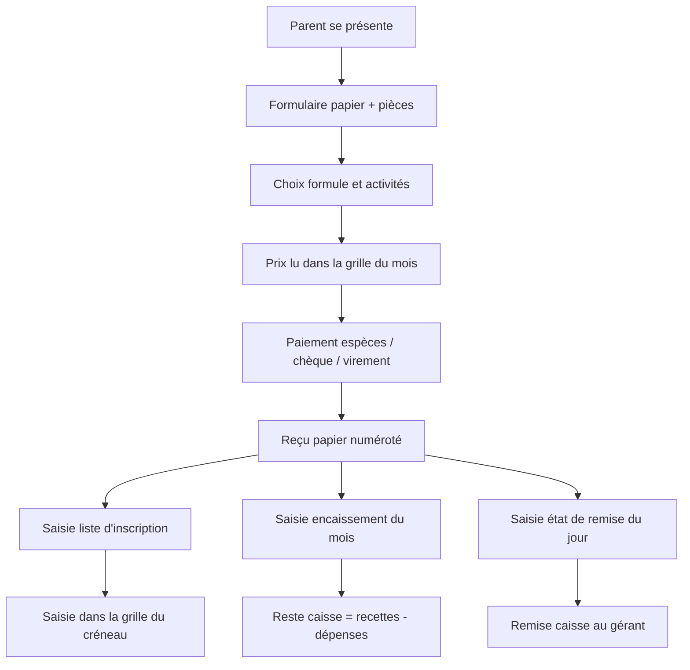
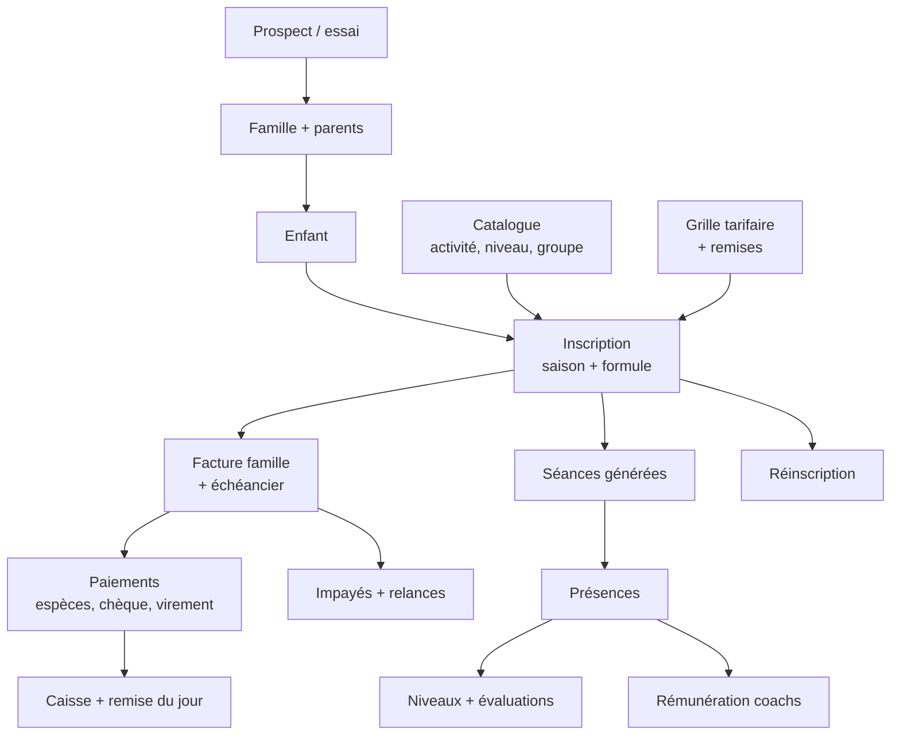

# Clubify — Cahier des charges fonctionnel cible (cas Le P'tit Club)

> **Version 1 — figée le 19/09/2026 — lecture seule.**
> Référence métier du projet Clubify. Ne pas modifier : toute évolution passe par les fiches de
> `docs/features/` et par une entrée dans `docs/decisions/`.

## Lecture rapide

Le P'tit Club fonctionne par inscription d'un enfant dans un groupe pour une saison, payée au comptoir en espèces, chèque ou virement : c'est ce modèle, et non la réservation à la séance, qui doit être le cœur de Clubify.

1. Quatre classeurs Excel, un formulaire et un carnet de reçus : chaque paiement est saisi 3 fois, et le reste à payer n'est suivi nulle part.
2. En janvier 2026 le club a encaissé 30 340 DH et dépensé 23 600 DH, sans aucune carte bancaire ; sur les 11 paiements d'abonnement visibles, au moins 5 (1 200 DH trois fois, 2 700, 6 750) ne correspondent à aucune combinaison de la grille.
3. Aujourd'hui le prix se lit dans 6 grilles selon l'activité, la formule, 1 ou 2 séances par semaine et le mois d'entrée, plus 500 DH de frais annuels. Décision prise avec le club : la cible tarife par durée d'offre (1, 2, 3, 6, 9 ou 10 mois), avec forfait multi-séances à prix réduit et tarifs saisonniers optionnels.
4. Votre document fonctionnel est bâti autour des réservations, pénalités et no-show : aucun document du club ne montre cet usage.
5. Le formulaire contient une donnée de sécurité absente du périmètre : les personnes autorisées à récupérer l'enfant.
6. Aucune feuille de présence n'existe, la reconnaissance se faisant de visu (confirmé par le club) : le pointage sera une nouveauté, pas une numérisation, et devra donc être introduit avec précaution.
7. Gymdesk, Glofox et GymMaster ciblent des salles adultes avec prélèvement par carte ; Jackrabbit et iClassPro sont de meilleurs modèles pour un club d'enfants. Aucun n'intègre de prestataire de paiement marocain.
8. La seule fonction concurrente pensée pour le paiement au comptoir est la relance « paiement sur place non reçu » de GymMaster.
9. Côté Maroc : déclaration CNDP avec autorisation pour les données de santé, droit de timbre de 0,25 % sur les espèces, fin du monopole du CMI, facturation électronique encore sans décret en avril 2026.
10. La paie complète et la comptabilité générale doivent rester hors de l'application ; elle produit des états et des exports.

Conventions : chaque élément est marqué D (visible dans vos documents), P (demandé dans votre prompt), A (amélioration proposée) ou B (issu du benchmark). Les noms des enfants visibles sur les images ne sont volontairement pas repris.

## 1. Livrable 1 — Cartographie du processus actuel

Le club tourne sur 4 classeurs Excel 2007, un formulaire papier et un carnet de reçus papier, sans aucun lien entre eux : chaque paiement est ressaisi 2 à 3 fois et le reste à payer n'existe nulle part.

### 1.1 Outils et documents observés

| # | Support | Contenu observé (images) | Rôle dans le processus |
| --- | --- | --- | --- |
| D1 | Formulaire papier « Demande d'inscription » (img 17) | Photo, date ; enfant (nom, prénom, sexe, né le, né à, nationalité) ; formule (« Annuel », « 2 activités/semaine ») ; 9 activités à cocher ; 2 parents (nom, prénom, email, tél) ; règlement espèces/chèque ; personne à prévenir (nom, lien, tél) ; 2 personnes autorisées à récupérer l'enfant (nom, CIN, tél) ; cadre admin (CIN parents, photo, certificat médical) ; signature + règlement intérieur | Dossier d'inscription, archivé papier |
| D2 | Classeur « Liste d'inscription 2025-2026 » — onglet liste annuelle (img 1, 3) | Num, nom, prénom, date de naissance, âge (vide), date d'inscription, nombre d'activités, activité 1 à 4, téléphone | Registre des inscrits |
| D3 | Même classeur — onglets « 3 mois », « 6 mois », « carnet » (img 2) | Un onglet par formule ; carnet = 10 séances, activité, téléphone | Séparation des inscrits par formule |
| D4 | Même classeur — onglets Natation, Judo, Gymnastique, Boxe (img 4, 5, 6) | Grilles jour × tranche d'âge × créneau, noms saisis à la main, nombre de lignes fixe par créneau | Composition des groupes (rosters) |
| D5 | Classeur « Les frais tarifaires mis à jour » (img 7 à 12) | 6 onglets : trimestriel, annuel 10 mois, puis décembre (8 mois), janvier (7), février (6), mars (5) ; 6 activités × 1 ou 2 séances/semaine ; frais d'assurance et d'inscription 500 DH | Grille tarifaire et prorata d'entrée en cours de saison |
| D6 | Classeur « Encaissement 2025-2026 » (img 13, 14, 15) | Un onglet par mois ; recettes (nom, prénom, type de cours, montant, mode, date, n° reçu) ; bloc « vente matériel » ; dépenses (description, cours, montant) ; « Reste caisse » | Journal de caisse mensuel recettes/dépenses |
| D7 | Classeur « État de remises » (img 16) | Un onglet par jour ; nom, prénom, activité, montant, n° chèque, espèces, commentaire (« 3 mois », « Année »), n° reçu, date d'encaissement, total du jour | Bordereau journalier de remise des espèces et chèques |
| D8 | Carnet de reçus papier (déduit : n° 113 à 125 séquentiels) | Numéro unique partagé par abonnements et ventes de matériel | Preuve de paiement remise au parent |
| D9 | Affiches planning par activité (img 18, 19) | Jour × heure × tranche d'âge, « activités réservées aux enfants jusqu'à 14 ans » | Communication du planning aux parents |

### 1.2 Acteurs

| Acteur | Ce qu'il fait aujourd'hui | Source |
| --- | --- | --- |
| Accueil / administratif | Reçoit le parent, fait remplir D1, vérifie les pièces, encaisse, remplit le reçu, saisit D2, D4, D6, D7 | Déduit des documents |
| Gérant / propriétaire | Reçoit la remise du jour, suit le reste caisse, fixe les grilles tarifaires | D6, D7 |
| Coachs | Salariés mensuels ; un même coach cumule salaire salle, salaire piscine et coaching privé payé à part | D6 dépenses |
| Prestataires | Ménage, nettoyage piscine | D6 dépenses |
| Parents (1 ou 2) | Remplissent le formulaire, paient, désignent urgence et personnes autorisées | D1 |
| Enfant (3 à 14 ans) | Adhérent | D1, D9 |
| Adulte client | Au moins 1 adulte (né en 1984) sur un carnet de boxe | D3 |

### 1.3 Étapes reconstituées

Une inscription déclenche donc 4 saisies manuelles (G, H, I, J) à partir du même événement.

### 1.4 Décisions, exceptions et points de contrôle

| Type | Constat | Image |
| --- | --- | --- |
| Décision | Le groupe est choisi par jour + tranche d'âge + créneau ; le judo ajoute un niveau (Kids débutants / Kids avancés / Baby / Ado) | 5, 6 |
| Décision | Le prix dépend de l'activité, du nombre de séances/semaine, de la formule et du mois d'entrée | 7 à 12 |
| Décision | Validation de l'inscription seulement après formulaire + versement des droits | 17 |
| Exception | Montants encaissés hors grille (1 200, 2 700, 6 750 DH ; à l'inverse 3 350 DH = 2 850 + 500 de frais, conforme à la grille de janvier) : il s'agit de reliquats, paiements partiels soldant un reste dû, sans aucune trace écrite du solde (confirmé par le club) | 13 |
| Exception | Un seul virement de 4 500 DH couvre 2 enfants d'une même famille et 3 activités | 13, 14 |
| Exception | Mention « c-e » à côté de certains prénoms en gymnastique : « cours d'essai », confirmé par le club | 5 |
| Exception | Lignes jaunes = inscrits datés de sept. 2024 à fév. 2025, donc de la saison précédente, reportés dans la liste 25-26 (sens exact à confirmer) | 1, 3 |
| Exception | Carnet de 10 séances (boxe, natation), y compris pour un adulte et un numéro étranger (+33) | 2 |
| Contrôle | Numéro de reçu séquentiel reporté dans D6 et D7 | 13, 16 |
| Contrôle | Numéro de chèque noté dans l'état de remise | 16 |
| Contrôle | Checklist pièces : CIN parents, photo, certificat médical | 17 |
| Contrôle | Total du jour (8 210 DH le 21/01) et reste caisse du mois (30 340 − 23 600 = 6 740 DH) | 14, 15, 16 |

### 1.5 Anomalies de données visibles

Elles montrent ce que l'application doit empêcher par construction.

- Colonne « Âge » vide partout ; dates de naissance et téléphones manquants sur une partie des lignes.
- Date saisie « 01/09/20205 » ; encaissements de janvier 2026 datés 2025 ; numéro d'ordre 18 en double ; reçu n° 78 au milieu de la série 113–125.
- Colonne « Activité 3 » utilisée pour écrire « 12 mois » : la durée n'a pas de champ.
- « Nombre d'activités = 4 » avec Natation, Natation, Boxe, Boxe : la colonne compte en réalité des séances hebdomadaires, pas des activités.
- Créneaux impossibles (« 16h30-15h30 », « 17h30-16h30 ») dans la grille gymnastique.
- Tranches d'âge différentes entre l'affiche gym (4-5, 6-7, 8-10+) et la grille Excel (3-4, 5-7, 8-10+).
- Catalogue incohérent : le formulaire liste Ninja Warrior, Danse classique, Zumba Kids, Afro Dance, Genius Club (absents de la grille tarifaire) ; la grille liste Kick-Boxing et Karaté (absents du formulaire).
- Grille de mars : 1 séance/semaine au même prix qu'en février (2 550 DH) alors que les autres prix baissent : erreur probable ou plancher volontaire.
- Vente matériel : libellés croisés (ligne « Lunette » avec article « Bonnet » à 200 DH) ; la même vente figure comme « Kimono » dans D6 et « 2 Kimono » au nom d'un enfant dans D7.

### 1.6 Ce qui n'apparaît dans aucun document

Aucune feuille de présence, aucun suivi du reste à payer ou des échéances, aucune liste d'attente, aucun planning coach ou salle, aucune trace de communication avec les parents, aucun stock. Ces processus sont soit oraux, soit inexistants : à confirmer avec le club.

### 1.7 Sources complémentaires (juillet et fin d'année)

Trois captures fournies après la première analyse révèlent deux activités absentes des classeurs Excel.

| # | Support | Contenu observé | Conséquence |
| --- | --- | --- | --- |
| D10 | Groupe WhatsApp « Le p'tit club » en diffusion, admins seulement | Annonce de la cérémonie de fin d'année (mercredi 24 juin à 15h30) avec cotisation de 200 DH à régler avant l'événement ; rappel du démarrage du Summer Camp avec inscriptions à finaliser sur place | WhatsApp est déjà le canal officiel du club, en diffusion unidirectionnelle : le modèle « annonce de masse » doit exister dès le MVP |
| D11 | Affiche « Summer Camp 2026 » | Du 29 juin au 24 juillet, de 9h00 à 16h00 (l'affiche indique 9h30, le club confirme 9h00), enfants de 3 à 10 ans, Bouskoura Ville Verte ; semaines thématiques (« Semaine 1 – Aventure & Découverte ») ; grille à lire en colonnes, une par jour de la semaine, détaillant les activités créneau par créneau : accueil et petit-déjeuner, sport, natation, atelier, déjeuner et temps calme, jeux, goûter et départ ; places limitées ; inscription par téléphone puis au club | Le camp est une offre autonome : programme journalier propre, tranche d'âge propre, tarif propre, repas et journée continue. Il ne se modélise pas comme un groupe de saison |

La cotisation de cérémonie n'est pas systématique : le club décide à chaque édition s'il la demande, et elle est due par enfant.

## 2. Analyse processus par processus

Seize processus sont identifiables ; onze sont Must Have car ils touchent directement l'argent encaissé ou la sécurité des enfants. Priorités : M = Must, S = Should, C = Could, F = Future.

| # | Processus actuel | Problème / limite | Fonctionnalité cible | Automatisation possible | Prio |
| --- | --- | --- | --- | --- | --- |
| P1 | Inscription sur formulaire papier, pièces cochées à la main (img 17) | Dossier non consultable, illisible, pas de recherche, pas de lien avec le paiement ; aucune donnée médicale ni adresse | Dossier famille numérique : parents, enfants, urgence, personnes autorisées, pièces scannées, acceptation du règlement | Formulaire rempli par le parent sur tablette ou lien ; rappel des pièces manquantes ; alerte certificat médical expiré | M |
| P2 | Personnes autorisées à récupérer l'enfant notées sur papier avec CIN (img 17) | Introuvable à la sortie des cours ; aucun contrôle réel | Fiche « sortie » affichable par l'accueil et le coach : personnes autorisées avec photo et CIN | Alerte si la personne n'est pas dans la liste | M |
| P3 | Registre des inscrits en Excel, un onglet par formule (img 1 à 3) | Doublons, âge non calculé, téléphones manquants, fratries repérées à l'œil, statut codé par couleur | Liste adhérents filtrable, âge calculé, statut explicite, regroupement par famille | Statut actif/expiré calculé depuis l'inscription et le paiement | M |
| P4 | Affectation aux groupes par copie du nom dans une grille jour × âge × créneau (img 4 à 6) | Capacité implicite (nombre de lignes), double saisie, enfant oublié ou présent deux fois, créneaux erronés | Groupe = activité + tranche d'âge + niveau + créneau récurrent + capacité + coach ; roster généré depuis les inscriptions | Proposition des groupes compatibles avec l'âge ; blocage ou liste d'attente si complet | M |
| P5 | Tarif lu dans 6 grilles selon le mois d'entrée (img 7 à 12) | Un onglet à refaire chaque mois, prorata non linéaire calculé à la main, erreur visible en mars | Grille versionnée par saison : activité × fréquence × durée d'offre, tarifs saisonniers optionnels, frais d'inscription séparés | Prix proposé automatiquement selon la durée choisie et la date de début ; remise soumise à seuil et motif | M |
| P6 | Encaissement : reçu papier, puis saisie dans le journal du mois (img 13) | Pas de montant dû ni de solde : les reliquats sont encaissés sans qu'aucun document ne dise ce qui reste à payer ; un paiement famille mal ventilé ; erreurs d'année | Facture famille avec lignes par enfant/activité, paiements multiples, solde en temps réel, reçu PDF numéroté | Ventilation automatique du paiement ; numérotation continue ; envoi du reçu par WhatsApp/email | M |
| P7 | Chèques : numéro noté dans l'état de remise (img 16) | Pas de banque, pas de date d'encaissement prévue, pas de suivi des chèques différés ou rejetés | Registre des chèques : banque, numéro, titulaire, date de remise prévue, statut (reçu, remis, encaissé, rejeté) | Rappel la veille de la date de remise ; réouverture de la créance si rejet | M |
| P8 | État de remise journalier ressaisi depuis les reçus (img 16) | Troisième saisie du même paiement, écarts possibles avec le journal | Clôture de caisse : total attendu par mode, comptage, écart, remise au gérant signée | Bordereau généré depuis les paiements du jour | M |
| P9 | Dépenses et salaires dans le même onglet mensuel, reste caisse par soustraction (img 13, 14) | Pas de catégorie, colonne « Cours » vide, pas de distinction caisse/banque, pas de justificatif | Journal des dépenses catégorisé (salaires, prestataires, entretien…), rattachable à une activité, avec pièce jointe | Dépenses récurrentes pré-générées chaque mois ; résultat par activité | S |
| P10 | Rémunération : salaires fixes + lignes séparées par lieu + coaching privé à la séance (img 13) | Aucun lien entre séances réalisées et montant payé | Fiche de rémunération par intervenant : fixe, à la séance, avances, reste à payer | Calcul depuis les séances pointées | S |
| P11 | Vente de matériel (lunettes, bonnet, kimono) notée dans le journal, même série de reçus (img 15, 16) | Pas de catalogue ni de stock, libellés incohérents, vente non rattachée à l'enfant | Vente comptoir simple : article, prix, quantité, adhérent optionnel, sur la même facture famille | Décrément du stock, alerte seuil | S |
| P12 | Carnet de 10 séances suivi dans un onglet à part (img 2) | Aucun décompte des séances consommées, aucune date d'expiration | Pack de crédits : solde, expiration, débit au pointage | Alerte à 2 séances restantes, proposition de rachat | M |
| P13 | Cours d'essai noté « c-e » dans le roster (img 5, confirmé par le club) | Aucun suivi de conversion, aucune relance | Statut essai sur une place de groupe, avec date et issue | Relance J+1 du parent, conversion en inscription en 1 clic | S |
| P14 | Planning diffusé par affiches imprimées (img 18, 19) | Écarts avec les grilles Excel ; tout changement impose une réimpression | Planning unique, source des rosters, publiable en lien ou image | Notification aux seules familles du groupe concerné | S |
| P15 | Renouvellement : inscrits de la saison précédente recopiés et surlignés (img 1, hypothèse) | Pas d'échéance visible, pas de relance | Campagne de réinscription par saison, place réservée jusqu'à une date | Relances échelonnées, libération automatique de la place | M |
| P16 | Présence : aucun document ; reconnaissance visuelle par l'accueil et le coach | Aucune trace écrite : impossible de savoir qui est venu, de décompter un carnet, de répondre à un parent sur les absences ou de contrôler un impayé à l'arrivée | Appel par le coach sur mobile + pointage accueil, avec statut administratif affiché | Notification d'absence, débit de crédit | M |

## 3. Livrable 2 — Matrice de couverture

Votre périmètre couvre environ les trois quarts des besoins visibles ; les manques portent sur la saison sportive, les frais annuels, les chèques, la sortie des enfants et la réinscription. « Périmètre » = votre prompt (§1 à §17) + le document « brainstorming – functionnality ».

| Besoin actuel | Visible dans | Couvert par le périmètre | Fonctionnalité manquante | Prio |
| --- | --- | --- | --- | --- |
| Dossier enfant (identité, sexe, date et lieu de naissance, nationalité, photo) | img 17 | Partiel (§1) | Photo, lieu de naissance, nationalité | M |
| Deux parents avec email et téléphone | img 17 | Oui (§1, §16) | — | M |
| Personne à prévenir en cas d'urgence avec lien | img 17 | Oui (§1) | — | M |
| Personnes autorisées à récupérer l'enfant (nom, CIN, tél) | img 17 | Non (« autorisations éventuelles » trop vague) | Liste des personnes autorisées + écran de contrôle à la sortie | M |
| Pièces : CIN parents, photo, certificat médical | img 17 | Partiel (§1 documents) | Statut par pièce, date d'expiration du certificat, relance | M |
| Acceptation du règlement intérieur et signature | img 17 | Non | Consentements horodatés et versionnés (règlement, droit à l'image, données) | M |
| Données de santé, allergies | Absent des documents | Non | Fiche santé minimale (proposition) | S |
| Frais d'assurance et d'inscription 500 DH | img 7 à 12 | Non | Frais annuels par enfant et par saison, distincts de l'activité | M |
| Saison sportive (10 mois) et offres tarifées par durée | img 8 à 12 | Non (seulement « période ») | Entité Saison + offres par durée et tarifs saisonniers, versionnés | M |
| Prix selon 1 ou 2 séances par semaine | img 7 à 12 | Partiel (« fréquence » côté activité) | Fréquence hebdomadaire comme dimension tarifaire | M |
| Formules 3 mois, 6 mois, annuel | img 1, 7, 16 | Oui (§5) | — | M |
| Carnet de 10 séances | img 2, 13 | Oui (pack à crédits du document fonctionnel) | Décompte au pointage, expiration | M |
| Plusieurs activités par enfant, fratries | img 1, 13 | Oui (§1, §4, §5) | — | M |
| Un paiement pour plusieurs enfants | img 13, 14 | Oui (§1 responsable financier, §6 affectation) | Règle de ventilation par défaut | M |
| Paiements partiels, acomptes | img 13 (montants hors grille) | Oui (§5, §6, §7) | — | M |
| Chèques (numéro, remise) | img 13, 16, 17 | Partiel (cité au §19, absent du §6) | Registre des chèques : banque, date de remise prévue, rejet | M |
| Reçu numéroté en série continue | img 13, 15, 16 | Partiel (§6 facture/reçu) | Numérotation inviolable, annulation par avoir, réimpression | M |
| Remise journalière espèces + chèques au gérant | img 16 | Partiel (§14 clôture de caisse) | Bordereau de remise, dépôt en banque, écart de caisse | M |
| Dépenses, salaires, prestataires, reste caisse | img 13, 14 | Oui (§11, §14) | Catégories, rattachement à une activité | S |
| Coachs déclarés mais payés à la séance, paie établie par le gérant | img 13 | Oui (§11) | — | S |
| Vente de matériel sur la même caisse | img 15, 16 | Oui (§12, §13) | Vente rattachée à l'enfant et à la facture famille | S |
| Groupes par jour, tranche d'âge, niveau, créneau | img 4 à 6 | Oui (§2, §3, §4) | — | M |
| Cours d'essai | img 5 (confirmé) | Partiel (cité au §18 seulement) | Essai sur une place de groupe + conversion | S |
| Adultes clients (carnet boxe, coaching privé) | img 2, 13 | Non | Adhérent sans tuteur obligatoire ; séance privée | S |
| Planning affiché aux parents | img 18, 19 | Non | Planning publiable (lien, image, PDF) | S |
| Reprise des inscrits de la saison précédente | img 1, 3 (hypothèse) | Partiel (§4 renouvellement) | Campagne de réinscription et bascule de saison | M |
| Reprise des données Excel | Tous classeurs | Oui (import CSV du document fonctionnel) | Import avec contrôle des doublons et des dates | M |
| Présences | Absent des documents | Oui (§8) | — | M |
| Suivi des impayés et relances | Absent des documents | Oui (§7) | — | M |

Complément : le paramétrage de l'offre par le gérant (formules, forfaits combinant plusieurs activités, règles de combinaison) est visible sur le formulaire (img 17, « Formule annuelle, 2 activités / semaine ») et posé comme question dans votre brainstorming ; il n'était couvert que partiellement et fait l'objet du domaine 7.31.

Point d'attention : votre document « brainstorming – functionnality » est conçu autour de la réservation à la séance (fenêtres de réservation, pénalités d'annulation, no-show, surbooking). Aucun document du club ne montre ce fonctionnement. Le club fonctionne par inscription d'un enfant dans un groupe récurrent pour une saison ; ce modèle doit être le cœur, la réservation à la séance devenant un cas secondaire mais réel, confirmé par le club : cours privés avec coach dédié (par exemple en boxe), carnets, essais, stages, rattrapages.

## 4. Livrable 3 — Benchmark concurrence

Les trois solutions demandées sont des logiciels de salle de sport centrés sur la réservation et le prélèvement par carte ; les comparables les plus proches du P'tit Club sont les logiciels d'écoles d'activités pour enfants (Jackrabbit Class, iClassPro), centrés sur l'inscription d'un enfant dans une classe pour une session. Pages consultées le 18/09/2026 ; « n.v. » = non vérifié sur une source officielle.

### 4.1 Matrice comparative

| Fonctionnalité | Notre besoin | Gymdesk | Glofox | GymMaster | Autres | Pertinence pour le club |
| --- | --- | --- | --- | --- | --- | --- |
| Compte famille, payeur principal | Central | Oui : un membre principal contrôle paiement et fiches, bascule entre membres dans l'app | Oui : le compte enfant ne se connecte pas, le tuteur achète et réserve ; décharge parentale ; âge minimum ; pas sur toutes les offres | Oui : adhésion familiale / partagée | Jackrabbit : la famille est l'entité de base | Indispensable, à concevoir comme entité racine et non comme option |
| Inscription numérique sur tablette ou en ligne | P1 | Oui : décharges, champs personnalisés, choix de formule, paiement | Oui : portail web et app | Oui : inscription 100 % sans papier, formulaires et décharges | Jackrabbit : inscription par le parent, liste filtrée par l'âge de l'enfant | Forte : remplace le formulaire papier ; le filtre par âge évite les erreurs de groupe |
| Grades, niveaux, critères de passage | §17 | Oui : critères par programme (séances, jours au grade, heures, âge minimum, compétences), alerte « prêt à passer », promotion en masse avec fiche d'évaluation et frais de passage ; progression visible par le membre | n.v. | Configuration d'entraînement (n.v. pour les grades) | Jackrabbit et iClassPro : suivi de compétences visible par les parents | Forte pour judo, natation, gym ; les frais de passage de grade sont un revenu à prévoir |
| Liste d'attente | §4 | Via réservation | Oui : promotion automatique jusqu'à 30 min avant le cours, email + push, rang visible | Via réservations | Jackrabbit : liste d'attente par classe, le club contacte la famille | Forte, mais au niveau du groupe pour la saison, pas de la séance |
| Absence déclarée et rattrapage | Non prévu | n.v. | n.v. | n.v. | Jackrabbit : le parent déclare l'absence et planifie lui-même le rattrapage dans le portail | Forte : demande classique des parents, remplit les places vides, réduit les litiges |
| Pointage | §8 | Tablette d'accueil en libre-service, check-in mobile, pointage multiple par le staff | Self check-in, borne, contrôle d'accès | Borne de check-in, accès 24/7, détection de passage en double | Jackrabbit : appel par le coach dans un portail staff | L'appel par le coach est le plus adapté à des enfants de 3 à 10 ans ; la borne libre-service ne l'est pas |
| Relance des paiements non automatiques | §7 | Relance et re-facturation des échecs carte | Récupération automatique des échecs de paiement | Oui : déclencheur « paiement non reçu (adhésions payées sur place) », rapport de recouvrement | — | Seul GymMaster traite le cas du paiement au comptoir, qui est le cas marocain |
| Packs de séances / crédits | P12 | Oui : packs et frais ponctuels | Oui : packs de crédits | Oui | — | Oui : carnet de 10 séances existant |
| Essais | P13 | Oui : tout type d'essai | Parcours de conversion des prospects | Entonnoir de prospects | — | Oui, avec relance automatique |
| CRM prospects | Brainstorm | Gestion des leads, pages d'atterrissage, parrainage, avis | Capture de leads, parcours email/SMS/push | Étapes d'entonnoir configurables, tâches automatiques | — | Version simple suffisante : prospect, source, essai, relance |
| Automatisations | §15 | Éditeur d'automatisations | Parcours automatisés | Automatisation de tâches par déclencheurs | iClassPro : « Autopilot » (avis Capterra) | Forte, mais sous forme de règles prédéfinies paramétrables, pas d'éditeur libre au MVP |
| Tâches du personnel | Brainstorm | Actions staff automatisées | Gestion du staff | Oui : module Tâches | — | Utile : « appeler la famille X », « chèque à remettre demain » |
| Communication | §16 | Email, SMS, push, individuel ou en masse | Email, SMS, push, app à la marque du club | SMS, email, notifications app, aide à la rédaction par IA | Jackrabbit : annonces dans le portail parent | Aucun ne propose WhatsApp en natif (n.v.) : c'est notre différenciateur local |
| Application membre / parent | §16 | App + portail : planning, présences, progression, paiements | App à la marque du club | App et portail | Jackrabbit : portail parent (paiement, absences, compétences) | Portail web mobile d'abord ; app native en V2/V3 |
| POS et stock | §12, §13 | POS | POS, achats dans l'app | POS, stock, bons cadeaux, « rapport et caisse » | — | Version minimale : le club vend 3 à 5 articles |
| Pause / gel d'abonnement | §4 | n.v. | n.v. | Oui : mises en pause, y compris en masse | — | Le gel en masse sert pour une fermeture (travaux piscine, Ramadan) |
| Stages, camps, événements | §18 | n.v. | Cours et sessions sur un calendrier unique | n.v. | Jackrabbit : camps ; iClassPro : camps, anniversaires, cours privés (avis Capterra) | Forte en V2 : vacances scolaires, anniversaires = revenus additionnels |
| Cours privés | Img 13 | Oui : planning d'entraînement privé | Rendez-vous | Réservation de coach et de ressources | Jackrabbit : leçons privées selon disponibilité salle/coach | Oui : le coaching de boxe existe déjà |
| Reporting | §9 | Revenus, rétention, présences, prévision de revenus | Tableau de bord, prédiction d'attrition par IA | KPI, rapports personnalisables, export Google Sheets, rapports planifiés | — | Tableau de bord opérationnel au MVP ; prédictif inutile à cette taille |
| Multi-sites | §30 | n.v. | Oui : pilotage multi-sites, redevances de franchise | Oui | Jackrabbit : classes multi-lieux | Architecture dès le MVP, fonctionnalités en V3 |
| Contrôle d'accès physique | §18 | Oui | Oui | Oui : cœur de l'offre | — | Faible : les enfants sont accompagnés, pas de tourniquet |
| Paiement en ligne | §6 | Stripe, Square, Authorize.net, GoCardless, Ezypay ; saisie manuelle possible dans les pays non couverts | Paiements intégrés | Prestataires intégrés | — | Aucun prestataire marocain : argument commercial majeur pour Clubify |
| Import depuis Excel | P3 | Oui : membres et présences | n.v. | Import en masse de prospects | — | Indispensable pour l'adoption |
| API, intégrations | §29 | Intégrations limitées | n.v. | Une dizaine d'intégrations | Jackrabbit : API et Zapier | V3 |

### 4.2 Fonctionnalités à reprendre, avec complexité et dépendances

| Fonctionnalité | Source | Utilité pour le club | Prio | Complexité | Dépendances |
| --- | --- | --- | --- | --- | --- |
| Famille comme entité racine, payeur principal | Gymdesk, Glofox, Jackrabbit | Facture et solde uniques par famille, fratries | M | Moyenne | Aucune : socle |
| Liste des groupes filtrée par l'âge de l'enfant | Jackrabbit | Supprime les erreurs d'affectation | M | Faible | Activités, groupes |
| Déclencheur « paiement sur place non reçu » | GymMaster | Relance adaptée aux espèces et chèques | M | Faible | Échéancier, notifications |
| Absence déclarée par le parent + rattrapage | Jackrabbit | Satisfaction parents, places remplies | S | Moyenne | Présences, capacité, portail parent |
| Critères de passage de niveau + alerte « prêt » | Gymdesk | Progression visible, fidélisation | S | Moyenne | Présences, référentiel de compétences |
| Passage de grade en masse avec frais | Gymdesk | Revenu additionnel (ceintures, tests) | C | Faible | Niveaux, facturation |
| Liste d'attente avec promotion et notification | Glofox | Remplissage des groupes | S | Moyenne | Groupes, notifications |
| Politiques par activité ou niveau présentées au parent concerné | Jackrabbit | Règlement piscine différent du judo | S | Faible | Consentements |
| Gel en masse | GymMaster | Fermetures exceptionnelles | C | Faible | Inscriptions |
| Tâches staff générées par règles | GymMaster | Suivi des relances et des chèques | S | Moyenne | Moteur de règles |
| Entonnoir de prospects à étapes | GymMaster, Glofox | Conversion des essais | S | Faible | CRM |
| Rapports planifiés par email | GymMaster | Le gérant reçoit la caisse du jour sans se connecter | S | Faible | Reporting |
| Stages et camps de vacances | Jackrabbit, iClassPro | Revenus pendant les vacances scolaires | S | Moyenne | Calendrier scolaire, inscriptions |

Fonctionnalités écartées volontairement : contrôle d'accès 24/7 et tourniquets, prédiction d'attrition par IA, app à la marque du club, redevances de franchise, bibliothèque de contenus vidéo, ludification des visites. Elles répondent à des salles adultes en libre accès, pas à un club d'enfants de 150 à 300 inscrits.

Sources : [Gymdesk – membres](https://gymdesk.com/features/members), [Gymdesk – présences](https://gymdesk.com/features/attendance), [Gymdesk – app](https://gymdesk.com/features/member-app), [Glofox – fonctionnalités](https://www.glofox.com/features/), [Glofox – comptes famille](https://support.glofox.com/hc/en-us/articles/360004781978-How-to-Set-up-Family-Accounts), [Glofox – liste d'attente](https://support.glofox.com/hc/en-us/articles/360006355297-How-to-Set-up-a-Waitlist), [GymMaster – fonctionnalités](https://www.gymmaster.com/gymmaster-features/), [GymMaster – version 1435](https://www.gymmaster.com/release-notes/v1435/), [GymMaster – aide](https://help.gymmaster.com/?id=tasktype), [Jackrabbit – gestion des classes](https://www.jackrabbitclass.com/features/class-management/), [Jackrabbit – portail parent](https://help.jackrabbitclass.com/help/parent-portal-enroll-into-class), [iClassPro – avis Capterra](https://www.capterra.com/p/127097/iClassPro/).

## 5. Spécificités Maroc

Quatre contraintes locales structurent le produit : encaissement au comptoir (espèces, chèques), déclaration CNDP avec données de mineurs et de santé, droit de timbre sur les espèces, et WhatsApp comme canal principal. Statut : V = vérifié sur source, C = à confirmer avec l'expert-comptable ou le juriste du club.

| Sujet | Constat | Conséquence produit | Statut |
| --- | --- | --- | --- |
| Moyens de paiement réels | Sur janvier 2026, le club encaisse en espèces, chèques et virements ; aucune carte (img 13, 16, 17) | Le parcours d'encaissement au comptoir est le parcours principal, pas un mode dégradé | V (documents) |
| Chèques | Numéro de chèque suivi à la main ; montants élevés payés par chèque | Registre des chèques avec date de remise, statut et rejet ; chèques différés et chèques de garantie confirmés par le club, à distinguer dans le solde | V (documents) / C (pratique des différés) |
| Paiement par carte et en ligne | Le quasi-monopole du CMI sur l'acquisition a pris fin : nouveaux acquéreurs autorisés depuis le 1er mai 2025, une dizaine fin 2025, portefeuille CMI cédé en 2026 ([Conseil de la concurrence](https://maroc.ma/fr/actualites/paiement-electronique-les-etablissements-de-paiement-et-les-filiales-des-banques-autorises-operer-des), [Aujourd'hui le Maroc](https://aujourdhui.ma/economie/deploiement-des-terminaux-de-paiement-ouverture-du-marche-de-lacquisition-montee-en-puissance-du-paiement-mobile-la-transition-vers-le-zero-cash-saccelere)) | Le club n'a pas de TPE aujourd'hui et en envisage un plus tard : la carte est d'abord un simple mode d'encaissement saisi au comptoir. Couche « prestataire de paiement » abstraite pour la suite, lien de paiement envoyé par WhatsApp en V2 ; ne jamais coder un prestataire en dur | V |
| Frais d'interchange | Plafond domestique abaissé à 0,50 % au 1er octobre 2026 selon Bank Al-Maghrib ([Le360](https://fr.le360.ma/economie/monetique-bank-al-maghrib-et-le-conseil-de-la-concurrence-actent-la-fin-du-monopole-du-cmi_6LWY7QC67RH4BGBPJNW4CLZ2X4/)) | Le coût d'acceptation carte baisse : argument pour proposer le TPE et le lien de paiement aux clubs | V (presse) |
| Droit de timbre sur les espèces | Un droit de timbre de quittance de 0,25 % s'applique aux paiements en espèces, déclaré et payé par voie électronique dans le mois suivant ([Médias24](https://medias24.com/2018/02/16/droit-de-timbre-de-025-sur-les-transactions-en-especes-la-clarification-du-fisc/), [Aujourd'hui le Maroc](https://aujourdhui.ma/actualite/droit-de-timbre-de-quittance-les-clarifications-de-la-dgi)) | Rapport mensuel « encaissements en espèces » avec base et droit calculé ; option d'affichage sur le reçu ; applicabilité selon la forme juridique du club | V (principe) / C (applicabilité au club) |
| Facturation électronique | Base légale à l'article 145-IX du CGI, démarrage annoncé pour 2026 par les grandes entreprises ; en avril 2026 le décret d'application n'était pas publié et les calendriers circulant en ligne n'étaient pas officiels ([Upsilon Consulting](https://www.upsilon-consulting.com/facturation-electronique-maroc-2026/)) | Factures à numérotation continue, données structurées (ICE, lignes, taxes), avoirs et non suppression : le modèle sera prêt pour un futur raccordement, sans le développer maintenant | V (incertitude) |
| TVA | Le club est une société (confirmé) ; le régime applicable aux activités sportives pour enfants dépend de la forme juridique et de l'activité, et reste à valider avec l'expert-comptable | Taux de taxe paramétrable par produit et par club (y compris 0 %), prix saisis TTC ; aucune règle codée en dur | C |
| Protection des données | Tout traitement doit être déclaré à la CNDP avant mise en œuvre ; les données de santé relèvent de l'autorisation préalable ; le sous-traitant doit être encadré par contrat ([CNDP – formalités](https://www.cndp.ma/formalites/), [CNDP – conditions](https://www.cndp.ma/conditions/)) | Le certificat médical et la fiche santé sont des données sensibles : chiffrement, accès par rôle, journal d'accès, durée de conservation ; le club reste responsable de traitement et n'a pas encore déclaré ; Clubify, sous-traitant, doit lui fournir un modèle de contrat et un dossier d'aide à la déclaration, à déposer avant la mise en service | V |
| Mineurs | Les données concernent des enfants de 3 à 14 ans ; le consentement est donné par le parent | Consentements parentaux horodatés (données, droit à l'image, WhatsApp) ; aucun compte pour l'enfant | V (documents) / C (formulation juridique) |
| Hébergement | Le transfert de données hors du Maroc est encadré par la loi 09-08 | Choix d'hébergement à valider avant le premier client ; prévoir la localisation des données par tenant | C |
| WhatsApp et SMS | Canal usuel des parents ; le formulaire ne recueille aucun consentement à ce jour | API WhatsApp Business via un fournisseur agréé, modèles de messages pré-approuvés, consentement et désinscription par parent ; SMS en secours ; email secondaire | C (coûts et fournisseur) |
| Langues | Documents du club 100 % en français | Interface FR au MVP, architecture i18n dès le départ, arabe avec affichage droite-à-gauche et anglais ensuite ; noms saisis en caractères latins, champ arabe optionnel | V (documents) |
| Calendrier | Saison de référence de 10 mois, de septembre à juin, plus juillet en complément : Summer Camp à programme et tarifs propres, occupant les installations de 9h00 à 16h00, et fin des périodes courtes souscrites tardivement, dont les séances passent après 16h00 (d'où les grilles se terminant en juillet) — confirmé par le club ; pics le mercredi après-midi et le samedi (img 4, 18, 19) ; fêtes religieuses à date mobile | Calendrier par club : saison, vacances scolaires, jours fériés fixes et mobiles saisis chaque année, horaires spéciaux Ramadan appliqués en masse | V (documents) / proposition |
| Téléphones | Numéros 06…, un numéro +33 (img 2) | Format international E.164 obligatoire pour WhatsApp, indicatif +212 par défaut | V (documents) |
| Identité | CIN demandée pour les parents et les personnes autorisées (img 17) | Champ CIN avec contrôle de format, accès restreint | V (documents) |

## 6. Architecture fonctionnelle

Le modèle tourne autour de deux objets : l'Inscription (un enfant, un groupe, une saison, une formule) et le Compte famille (tout ce qui est dû et payé). Tout le reste les alimente ou les lit.

### 6.1 Chaîne métier principale

Lecture : le pointage (PR) consulte en temps réel l'inscription et le solde de la famille ; la rémunération et les niveaux se calculent depuis les présences, jamais par ressaisie.

### 6.2 Modules et responsabilités

| Module | Responsabilité | Consomme | Produit |
| --- | --- | --- | --- |
| Socle plateforme | Tenants (club, sites), utilisateurs, rôles, journal d'audit, paramètres, i18n, fichiers | — | Identité et droits pour tous |
| Familles et adhérents | Famille, parents, enfants, adultes, contacts, personnes autorisées, pièces, consentements | Socle | Dossiers |
| Catalogue | Activités, tranches d'âge, niveaux, groupes, créneaux récurrents, lieux, capacité | Socle | Offre |
| Calendrier et séances | Saison, vacances, fériés, génération des séances, annulation, remplacement | Catalogue, coachs | Séances datées |
| Inscriptions | Inscription, essai, liste d'attente, changement de groupe, gel, résiliation, réinscription | Adhérents, catalogue, tarifs | Rosters, droits d'accès aux séances |
| Tarification | Formules et forfaits combinés paramétrés par le gérant, grilles par saison, fréquence et durée d'offre, tarifs saisonniers, frais annuels, remises famille et multi-activités, packs, simulateur | Catalogue | Prix proposés, lignes de facture |
| Facturation et encaissements | Factures, avoirs, échéanciers, paiements, ventilation, reçus, chèques | Inscriptions, tarifs, ventes | Solde famille, reçus |
| Caisse et dépenses | Sessions de caisse, remise du jour, dépenses, résultat mensuel | Encaissements | Bordereaux, exports comptables |
| Présences | Appel coach, pointage accueil, statut administratif, débit de crédits, sortie de l'enfant | Séances, inscriptions, solde | Présences, alertes |
| Progression | Référentiels de compétences, évaluations, passages de niveau | Présences, catalogue | Bulletins, propositions de changement de groupe |
| Coachs et rémunération | Profils, disponibilités, absences, modèles de rémunération, états de paie | Séances, présences | Montants dus, export |
| Boutique et stock | Articles, variantes, stock, ventes | Facturation | Lignes de vente, mouvements |
| Notifications | Modèles, canaux (WhatsApp, SMS, email, in-app), règles, consentements, historique | Tous les événements | Messages tracés |
| Portail parent | Dossier, planning, présences, factures, paiement, absences, réinscription | Tous | Actions en libre-service |
| CRM | Prospects, sources, étapes, tâches | Notifications | Conversions |
| Pilotage | Tableau de bord opérationnel, rapports, exports | Tous | KPI |

### 6.3 Principes de conception

- Un seul moteur d'événements : chaque fait métier (inscription créée, paiement reçu, séance annulée, enfant absent) est publié une fois ; notifications, tâches et tableaux de bord s'y abonnent.
- Un seul registre financier : inscriptions, frais annuels, packs, articles et frais de grade produisent tous des lignes sur la facture famille.
- Règles métier en configuration par club : politique d'accès en cas de dette, délais de relance, ventilation des paiements, âges, capacités.
- Identifiant de club et de site sur chaque donnée dès le premier jour.

## 7. Livrable 4 — Backlog fonctionnel cible

Le backlog compte 203 fonctionnalités sur 32 domaines, dont 118 au MVP ; ce MVP est livrable en 4 lots successifs décrits en synthèse (point J). Acteurs : ADM = accueil/administratif, GER = gérant, COA = coach, PAR = parent, SYS = système. Origine : D = visible dans vos documents, P = demandé dans le prompt, A = amélioration proposée, B = benchmark. Prio : M/S/C/F.

### 7.1 CRM / Prospects

| ID | Fonctionnalité | Description | Acteur | Règle métier | Orig. | Prio | Version | Dépendances |
| --- | --- | --- | --- | --- | --- | --- | --- | --- |
| CRM-01 | Fiche prospect | Parent, enfant(s), âge, activité souhaitée, source | ADM | Téléphone unique ; détection de doublon avec une famille existante | P | S | V2 | FAM-01 |
| CRM-02 | Entonnoir à étapes | Nouveau, contacté, essai planifié, essai fait, inscrit, perdu | ADM | Étapes configurables par club | B | S | V2 | CRM-01 |
| CRM-03 | Conversion en famille | Transforme le prospect en famille + enfant sans ressaisie | ADM | Historique du prospect conservé | P | S | V2 | FAM-01 |
| CRM-04 | Formulaire de contact public | Lien ou QR code, alimente les prospects | PAR | Consentement de contact obligatoire | B | C | V2 | NOT-06 |
| CRM-05 | Relances automatiques | Message J+1 après essai, J+7 sans réponse | SYS | Arrêt dès conversion ou refus | B | S | V2 | NOT-01 |

### 7.2 Familles / Adhérents

| ID | Fonctionnalité | Description | Acteur | Règle métier | Orig. | Prio | Version | Dépendances |
| --- | --- | --- | --- | --- | --- | --- | --- | --- |
| FAM-01 | Compte famille | Entité racine regroupant parents, enfants, factures | ADM | Toute facture appartient à une famille | P, B | M | MVP | PLT-01 |
| FAM-02 | Parents / tuteurs | 1 à n adultes : nom, prénom, tél, email, CIN, lien | ADM | Au moins 1 téléphone valide au format international | D | M | MVP | FAM-01 |
| FAM-03 | Responsable financier | Parent destinataire des factures et relances | ADM | Exactement 1 par famille, modifiable, historisé | P | M | MVP | FAM-02 |
| FAM-04 | Fiche enfant | Nom, prénom, sexe, date et lieu de naissance, nationalité, photo | ADM | Âge calculé ; date de naissance obligatoire et plausible | D | M | MVP | FAM-01 |
| FAM-05 | Contacts d'urgence | 1 à n : nom, lien, téléphone | ADM | Au moins 1 obligatoire | D | M | MVP | FAM-04 |
| FAM-06 | Personnes autorisées à récupérer | Nom, CIN, tél, photo optionnelle | ADM, PAR | Visible du coach et de l'accueil ; modification tracée | D | M | MVP | FAM-04 |
| FAM-07 | Fiche santé | Allergies, contre-indications, remarques | ADM, PAR | Donnée sensible : accès restreint et journalisé | A | S | MVP | SEC-03 |
| FAM-08 | Pièces du dossier | CIN parents, photo, certificat médical, autres | ADM | Types de pièces exigés configurables par activité ; date d'expiration | D | M | MVP | PLT-05 |
| FAM-09 | Adhérent adulte | Adhérent sans tuteur | ADM | Tuteur obligatoire seulement si mineur | D | S | MVP | FAM-01 |
| FAM-10 | Statut adhérent | Prospect, actif, en pause, expiré, ancien | SYS | Calculé depuis les inscriptions, jamais saisi | P | M | MVP | INS-01 |
| FAM-11 | Vue 360° | Inscriptions, paiements, présences, évaluations, messages | ADM | Lecture selon le rôle | P | M | MVP | — |
| FAM-12 | Recherche et filtres | Nom, téléphone, activité, groupe, statut, solde | ADM | Recherche tolérante aux variantes d'orthographe des noms | P | M | MVP | — |
| FAM-13 | Import Excel | Reprise des listes existantes | ADM | Rapport d'erreurs, détection de doublons et fratries | D | M | MVP | — |
| FAM-14 | Fusion de doublons | Fusionne deux fiches | ADM | Réservé au gérant, tracé | A | S | V2 | — |

### 7.3 Onboarding

| ID | Fonctionnalité | Description | Acteur | Règle métier | Orig. | Prio | Version | Dépendances |
| --- | --- | --- | --- | --- | --- | --- | --- | --- |
| ONB-01 | Parcours d'inscription guidé | Famille, enfant, activité/groupe, formule, pièces, paiement en 1 flux | ADM | Reprise possible d'un brouillon | P | M | MVP | FAM, INS, FAC |
| ONB-02 | Saisie par le parent | Tablette à l'accueil ou lien envoyé | PAR | L'accueil valide avant création définitive | P, B | S | V2 | ONB-01 |
| ONB-03 | Consentements | Règlement intérieur, données, droit à l'image, WhatsApp | PAR | Horodatés, versionnés, par parent | D | M | MVP | — |
| ONB-04 | Fiche d'inscription PDF | Reproduit le formulaire actuel pour signature | ADM | Généré depuis les données saisies | D | S | MVP | — |
| ONB-05 | Validation conditionnelle | Inscription « en attente » tant que droits non versés | SYS | Règle du formulaire actuel ; seuil configurable | D | M | MVP | FAC-01 |

### 7.4 Activités

| ID | Fonctionnalité | Description | Acteur | Règle métier | Orig. | Prio | Version | Dépendances |
| --- | --- | --- | --- | --- | --- | --- | --- | --- |
| ACT-01 | Catalogue d'activités | Nom, description, catégorie, statut, couleur | GER | Catalogue unique utilisé par formulaires, tarifs et planning | D, P | M | MVP | — |
| ACT-02 | Tranches d'âge | Bornes min/max par activité | GER | Âge évalué à une date de référence configurable | D | M | MVP | ACT-01 |
| ACT-03 | Pièces requises par activité | Ex. certificat médical pour natation | GER | Bloquant ou simple alerte, au choix | P | S | MVP | FAM-08 |
| ACT-04 | Lieux | Salle, piscine, tatami ; capacité | GER | Un lieu ne porte qu'une séance à la fois, sauf lieu partageable | P | M | MVP | — |

### 7.5 Niveaux

| ID | Fonctionnalité | Description | Acteur | Règle métier | Orig. | Prio | Version | Dépendances |
| --- | --- | --- | --- | --- | --- | --- | --- | --- |
| NIV-01 | Niveaux personnalisables | Ex. Baby, Débutant, Avancé, ceintures | GER | Ordonnés, propres à chaque activité | D, P | M | MVP | ACT-01 |
| NIV-02 | Référentiel de compétences | Liste de compétences par niveau | COA | Versionné par saison | P, B | S | V2 | NIV-01 |
| NIV-03 | Évaluation | Compétences acquises, commentaire | COA | Visible du parent après publication | P | S | V2 | NIV-02 |
| NIV-04 | Critères de passage | Séances suivies, durée au niveau, âge, compétences | GER | Alerte « prêt à passer » | B | S | V2 | PRE-01 |
| NIV-05 | Passage de niveau | Individuel ou en masse, frais optionnels ; pour le judo et le karaté, le coach prononce le passage en fin de saison et le diplôme est remis à la cérémonie | COA, GER | Propose un changement de groupe ; historisé | B | S | V2 | GRP-05 |

### 7.6 Groupes

| ID | Fonctionnalité | Description | Acteur | Règle métier | Orig. | Prio | Version | Dépendances |
| --- | --- | --- | --- | --- | --- | --- | --- | --- |
| GRP-01 | Groupe | Activité + tranche d'âge + niveau + créneau(x) + lieu + coach + capacité propre au groupe (6 par défaut en piscine) | GER | Capacité obligatoire, saisie groupe par groupe et modifiable en cours de saison ; valeur par défaut héritée de l'activité ou du lieu, jamais codée en dur | D | M | MVP | ACT, NIV |
| GRP-02 | Roster | Liste des inscrits du groupe, générée | ADM, COA | Jamais saisie à la main | D | M | MVP | INS-01 |
| GRP-03 | Taux de remplissage | Places prises, réservées, libres | ADM | Essais et places réservées comptés à part | P | M | MVP | GRP-01 |
| GRP-04 | Groupes compatibles | Propose les groupes selon âge, niveau, places | SYS | Dérogation possible avec motif, validée par le gérant et journalisée | P, B | M | MVP | ACT-02 |
| GRP-05 | Changement de groupe | Transfert avec date d'effet | ADM | Historise ; recalcule le prix si l'activité change | P | M | MVP | INS-01 |
| GRP-06 | Impression du roster | Feuille d'appel de secours | ADM | — | D | C | MVP | GRP-02 |

### 7.7 Planning

| ID | Fonctionnalité | Description | Acteur | Règle métier | Orig. | Prio | Version | Dépendances |
| --- | --- | --- | --- | --- | --- | --- | --- | --- |
| PLA-01 | Saison | Dates de début et fin, périodes | GER | Une inscription appartient à une saison | D | M | MVP | — |
| PLA-02 | Créneaux récurrents | Jour, heure début/fin par groupe | GER | Fin après début ; pas de chevauchement de lieu ni de coach, y compris avec les plages réservées par un événement | D, P | M | MVP | GRP-01 |
| PLA-03 | Génération des séances | Séances datées sur la saison | SYS | Saute fériés et fermetures | P | M | MVP | PLA-01, PLA-05 |
| PLA-04 | Vues jour, semaine, mois | Filtres activité, coach, lieu | Tous | — | P | M | MVP | PLA-03 |
| PLA-05 | Fériés, vacances et indisponibilités de lieux | Calendrier du club | GER | Fêtes mobiles saisies chaque année ; une plage réservée par un événement (camp d'été 9h00-16h00) rend le lieu indisponible pour les séances de saison | P | M | MVP | — |
| PLA-06 | Annulation, report | Avec motif et notification du groupe | ADM | Séance annulée par le club : ni débit de crédit ni absence | P | M | MVP | NOT-01 |
| PLA-07 | Remplacement de coach | Sur une séance ou une période | ADM | Rémunération attribuée au remplaçant | P | S | MVP | COA-01 |
| PLA-08 | Séance ponctuelle | Hors récurrence | ADM | Mêmes contrôles de conflit | P | S | MVP | — |
| PLA-09 | Horaires spéciaux | Bascule d'horaires sur une période (Ramadan) | GER | S'applique en masse, réversible | A | S | V2 | PLA-02 |
| PLA-10 | Planning publiable | Lien public, image ou PDF par activité | GER | Toujours issu du planning réel | D | S | V2 | PLA-02 |

### 7.8 Réservations

| ID | Fonctionnalité | Description | Acteur | Règle métier | Orig. | Prio | Version | Dépendances |
| --- | --- | --- | --- | --- | --- | --- | --- | --- |
| RES-01 | Cours d'essai | Place ponctuelle dans un groupe | ADM | Nombre d'essais par enfant limité ; gratuit ou payant | D, P | S | MVP | GRP-03 |
| RES-02 | Liste d'attente par groupe | File ordonnée | ADM | Promotion dans l'ordre ; délai de réponse configurable | P, B | S | V2 | GRP-03 |
| RES-03 | Place réservée | Blocage jusqu'à une date | ADM | Libération automatique à expiration | P | S | V2 | GRP-03 |
| RES-04 | Séance à l'unité / carnet | Réservation d'une séance par crédit | ADM, PAR | Débit au pointage | D | M | MVP | TAR-06 |
| RES-05 | Rattrapage | Séance dans un autre groupe après absence | PAR, ADM | Nombre et délai limités par règle | B | S | V2 | PRE-05 |
| RES-06 | Cours privé | Réservation d'une séance avec coach dédié, par un adhérent adulte ou un enfant, selon la disponibilité du coach et de la salle (cas observé : boxe) | ADM | La séance n'est proposée que si le coach et la salle sont libres, hors créneaux de groupe et hors plages réservées par un événement ; tarif propre, facturé à la séance | D | M | MVP | COA-01, PLA-08 |
| RES-07 | Stages et événements | Inscription à une session datée : camp d'été de juillet, stages de vacances, événements | ADM, PAR | Tarif propre, ouvert aux non-inscrits ; hors saison de 10 mois | B | S | V2 | FAC-01 |

### 7.9 Présences

| ID | Fonctionnalité | Description | Acteur | Règle métier | Orig. | Prio | Version | Dépendances |
| --- | --- | --- | --- | --- | --- | --- | --- | --- |
| PRE-01 | Appel par le coach | Liste du groupe sur mobile : présent, absent, retard | COA | Modifiable jusqu'à un délai, puis verrouillé | P, A | M | MVP | GRP-02 |
| PRE-02 | Pointage accueil | Recherche par nom ou QR famille | ADM | Un scan famille affiche tous les enfants attendus | P | M | MVP | — |
| PRE-03 | Statut administratif au pointage | Inscription valide, solde dû, pièce manquante | SYS | Politique par club : autoriser, alerter, valider, bloquer | P | M | MVP | FAC-06 |
| PRE-04 | Vue temps réel | Attendus, présents, absents, retards par séance | ADM, GER | — | P | M | MVP | PRE-01 |
| PRE-05 | Absence déclarée | Par le parent ou l'accueil, à l'avance | PAR, ADM | Distinguée de l'absence non prévenue | B | S | V2 | APP-01 |
| PRE-06 | Sortie de l'enfant | Affiche les personnes autorisées | COA, ADM | Remise à un tiers non listé = alerte et validation parent | D, A | S | V2 | FAM-06 |
| PRE-07 | Historique et assiduité | Par enfant, groupe, période | Tous | — | P | M | MVP | — |
| PRE-08 | Mode hors ligne | Appel sans réseau, synchronisé ensuite | COA | Conflits résolus au profit de la dernière saisie coach | A | S | V2 | PRE-01 |

### 7.10 Abonnements / Inscriptions

| ID | Fonctionnalité | Description | Acteur | Règle métier | Orig. | Prio | Version | Dépendances |
| --- | --- | --- | --- | --- | --- | --- | --- | --- |
| INS-01 | Inscription | Enfant + groupe(s) + saison + formule + fréquence + dates | ADM | Statuts : en attente, active, en pause, expirée, résiliée | D, P | M | MVP | GRP, TAR |
| INS-02 | Multi-activités | Plusieurs inscriptions par enfant | ADM | Contrôle des chevauchements horaires | D | M | MVP | INS-01 |
| INS-03 | Formules | durées de 1, 2, 3, 6, 9 ou 10 mois, plus le carnet de séances | GER | Durée et date de fin calculées | D | M | MVP | TAR-01 |
| INS-04 | Renouvellement | À l'échéance d'une formule courte | ADM, PAR | Reprend groupe et tarif en vigueur | P | M | MVP | NOT-03 |
| INS-05 | Réinscription de saison | Campagne, place prioritaire jusqu'à une date | GER | Place libérée automatiquement après la date | D, A | M | V2 | PLA-01 |
| INS-06 | Pause | Suspension datée, individuelle ou en masse | ADM | Prolonge la date de fin ou génère un avoir, selon règle | P, B | S | V2 | FAC-04 |
| INS-07 | Résiliation | Date d'effet, motif | ADM | Remboursement selon politique, validé par le gérant | P | S | MVP | FAC-04 |
| INS-08 | Changement d'activité | Avec recalcul | ADM | Différence facturée ou créditée | P | S | MVP | TAR |
| INS-09 | Alerte d'expiration | J-30, J-7, J | SYS | Délais configurables | P | M | MVP | NOT-03 |

### 7.11 Tarification

| ID | Fonctionnalité | Description | Acteur | Règle métier | Orig. | Prio | Version | Dépendances |
| --- | --- | --- | --- | --- | --- | --- | --- | --- |
| TAR-01 | Grille tarifaire | Prix par activité × formule × nombre de séances hebdomadaires, la colonne « 2 séances » étant un prix de forfait et non un doublement | GER | Versionnée par saison ; l'ancien prix reste sur les inscriptions existantes | D | M | MVP | ACT-01 |
| TAR-02 | Offres par durée et tarifs saisonniers | Une offre par durée (1, 2, 3, 6, 9 ou 10 mois), chacune avec son prix ; le gérant peut y ajouter un tarif propre à une période de l'année, par exemple la natation de mars à juin | GER | Le prix dépend de la durée souscrite, jamais du mois d'entrée ; un tarif saisonnier s'applique aux seules inscriptions dont la date de début tombe dans sa fenêtre, et prime alors sur le tarif courant ; un simple chevauchement ne suffit pas | D | M | MVP | TAR-01 |
| TAR-03 | Frais annuels | Assurance et inscription (500 DH) | SYS | 1 fois par enfant et par saison | D | M | MVP | PLA-01 |
| TAR-04 | Remises automatiques | Fratrie : barème paramétrable par rang d'enfant (par défaut 5 % sur le 2e, 10 % sur le 3e, extensible au-delà) | GER | Appliquée automatiquement dès qu'une même famille a plusieurs enfants inscrits sur la saison ; assiette et règle de rang configurables ; le multi-activités relève du forfait, pas d'une remise ; cumul avec une remise manuelle soumis à plafond | P | S | MVP | FAM-01 |
| TAR-05 | Remise manuelle | Montant ou pourcentage | ADM | Plafond par rôle, motif obligatoire, tracé | P | M | MVP | SEC-02 |
| TAR-06 | Packs de séances | Carnet de 10, validité | GER | Expiration, activités éligibles | D | M | MVP | — |
| TAR-07 | Codes promo | Période et offres éligibles | GER | — | P | C | V2 | — |
| TAR-08 | Tarif personnalisé | Prix négocié sur une inscription | GER | Réservé au gérant | P | S | MVP | — |

### 7.12 Paiements

| ID | Fonctionnalité | Description | Acteur | Règle métier | Orig. | Prio | Version | Dépendances |
| --- | --- | --- | --- | --- | --- | --- | --- | --- |
| FAC-01 | Facture famille | Lignes par enfant, activité, frais, article | SYS | Numérotation continue par club et exercice ; jamais supprimée | P, A | M | MVP | FAM-01 |
| FAC-02 | Échéancier | Paiement en plusieurs tranches datées | ADM | Total des tranches = total dû | P | M | MVP | FAC-01 |
| FAC-03 | Encaissement | Espèces, chèque, virement, carte TPE ; référence, date, utilisateur | ADM | Date du jour par défaut ; date passée réservée au gérant | D, P | M | MVP | FAC-01 |
| FAC-04 | Avoir et remboursement | Annule ou corrige une facture | GER | Validation du gérant ; lien avec la facture d'origine | P | M | MVP | FAC-01 |
| FAC-05 | Ventilation | Un paiement sur plusieurs lignes, enfants ou factures | SYS, ADM | Par défaut : échéance la plus ancienne ; modifiable | D, P | M | MVP | FAC-03 |
| FAC-06 | Solde famille | Dû, encaissé, attendu (chèques différés), reste, crédit | SYS | Temps réel | P | M | MVP | — |
| FAC-07 | Reçu numéroté | PDF, impression, envoi WhatsApp ou email | ADM | Série continue ; annulation par contre-passation | D | M | MVP | NOT-01 |
| FAC-08 | Registre des chèques | Banque, numéro, titulaire, montant, date de remise prévue, nature (encaissement ou garantie) et statut : reçu, différé, remis, encaissé, rejeté, restitué | ADM, GER | Un chèque différé apparaît en encaissement attendu et suspend les relances jusqu'à sa date de remise ; un chèque de garantie n'est jamais compté comme paiement et figure dans les pièces à restituer ; rejet = créance réouverte et tâche | D, A | M | MVP | FAC-03 |
| FAC-09 | Acompte / crédit famille | Trop-perçu conservé | SYS | Imputable sur toute facture de la famille | P | S | MVP | FAC-06 |
| FAC-10 | Lien de paiement en ligne | Envoyé au parent | PAR | Prestataire interchangeable ; à activer seulement quand le club aura choisi son acquéreur, le TPE sur place venant probablement avant | P | S | V2 | INT-02 |

### 7.13 Impayés

| ID | Fonctionnalité | Description | Acteur | Règle métier | Orig. | Prio | Version | Dépendances |
| --- | --- | --- | --- | --- | --- | --- | --- | --- |
| IMP-01 | Balance âgée | Dettes par famille et ancienneté | GER | — | P | M | MVP | FAC-06 |
| IMP-02 | Relances échelonnées | Avant, jour J, après, retard long | SYS | Calendrier configurable ; arrêt au paiement | P, B | M | MVP | NOT-03 |
| IMP-03 | Promesse de paiement | Date promise, note | ADM | Suspend les relances jusqu'à la date | A | S | MVP | IMP-02 |
| IMP-04 | Tâche de recouvrement | Appel à passer après n relances | SYS | Assignée à un rôle | B | S | V2 | ADM-05 |
| IMP-05 | Politique d'accès | Effet d'une dette au pointage | GER | 4 modes, seuils en montant et en jours | P | M | MVP | PRE-03 |

### 7.14 Notifications

| ID | Fonctionnalité | Description | Acteur | Règle métier | Orig. | Prio | Version | Dépendances |
| --- | --- | --- | --- | --- | --- | --- | --- | --- |
| NOT-01 | Moteur de notifications | Événement → règle → modèle → canal | SYS | Un événement, plusieurs abonnés | P, A | M | MVP | PLT-04 |
| NOT-02 | Modèles | Variables, FR puis AR | GER | Modèles WhatsApp soumis à approbation | P | M | MVP | — |
| NOT-03 | Règles financières | Paiement reçu, échéance, retard, expiration | SYS | Délais par club | P | M | MVP | — |
| NOT-04 | Règles planning | Annulation, report, changement d'horaire | SYS | Seules les familles du groupe | P | M | MVP | PLA-06 |
| NOT-05 | Règles présence | Absence non prévenue, arrivée | SYS | Optionnel par famille | P | S | V2 | PRE-01 |
| NOT-06 | Consentements et canaux | Préférence et opposition par parent | PAR | Messages de service distincts du marketing | A | M | MVP | ONB-03 |
| NOT-07 | Journal des envois | Statut, coût, échec | GER | Bascule SMS si WhatsApp échoue | A | S | MVP | — |
| NOT-08 | Autres règles | Pièce manquante ou expirée, anniversaire, place libérée | SYS | — | P | S | V2 | — |

### 7.15 Communication parents

| ID | Fonctionnalité | Description | Acteur | Règle métier | Orig. | Prio | Version | Dépendances |
| --- | --- | --- | --- | --- | --- | --- | --- | --- |
| COM-01 | Message ciblé | Par groupe, activité, coach, statut, solde | ADM | Aperçu du nombre de destinataires et du coût | P | M | MVP | NOT-01 |
| COM-02 | Historique par famille | Messages, notes, appels | ADM | — | P | S | MVP | — |
| COM-03 | Annonces | Fil d'actualités du club | GER | Visible dans le portail parent | B | C | V2 | APP-01 |
| COM-04 | Message du coach | Au groupe, via le club | COA | Numéro personnel du coach jamais exposé | A | S | V2 | — |

### 7.16 Coachs

| ID | Fonctionnalité | Description | Acteur | Règle métier | Orig. | Prio | Version | Dépendances |
| --- | --- | --- | --- | --- | --- | --- | --- | --- |
| COA-01 | Profil intervenant | Coordonnées, activités, niveaux enseignés, type de contrat | GER | Un intervenant peut cumuler plusieurs modèles de rémunération | D, P | M | MVP | PLT-02 |
| COA-02 | Disponibilités et absences | Plages, congés | GER, COA | Absence = séances à réaffecter, tâche créée | P | S | V2 | PLA-07 |
| COA-03 | Planning du coach | Ses séances, ses groupes | COA | Ne voit que ses groupes | P | M | MVP | PLA-04 |
| COA-04 | Séances réalisées | Décompte depuis les séances tenues | SYS | Séance tenue = appel validé | P | S | MVP | PRE-01 |

### 7.17 Rémunération

| ID | Fonctionnalité | Description | Acteur | Règle métier | Orig. | Prio | Version | Dépendances |
| --- | --- | --- | --- | --- | --- | --- | --- | --- |
| REM-01 | Modèles de rémunération | Fixe mensuel, à la séance, par participant, par activité ou lieu | GER | Plusieurs lignes par personne (ex. salle + piscine + coaching) | D, P | S | V2 | COA-01 |
| REM-02 | État mensuel | Séances réalisées × tarif, plus éventuel fixe, primes, moins avances et retenues ; établi par le gérant lui-même, l'application servant d'outil de calcul et de justificatif | GER | Validé puis figé | P | S | V2 | COA-04 |
| REM-03 | Avances | Saisie et imputation | GER | Imputées sur l'état suivant | P | S | V2 | REM-02 |
| REM-04 | Paiement de la rémunération | Génère la dépense correspondante | GER | Alimente le journal des dépenses | D | S | V2 | FIN-02 |
| REM-05 | Export pour la paie | Éléments variables (séances, montants) remis au comptable pour la déclaration | GER | Aucun calcul de cotisations ni bulletin dans l'application : elle calcule le dû à la séance, le comptable et le gérant gardent la partie déclarative | A | S | V2 | — |

### 7.18 Personnel administratif

| ID | Fonctionnalité | Description | Acteur | Règle métier | Orig. | Prio | Version | Dépendances |
| --- | --- | --- | --- | --- | --- | --- | --- | --- |
| PER-01 | Fiche personnel et prestataires | Accueil, ménage, entretien piscine | GER | Prestataire = fournisseur récurrent | D | S | V2 | — |
| PER-02 | Dépenses récurrentes | Salaires fixes et prestations pré-générés chaque mois | SYS | À confirmer avant comptabilisation | D, A | S | V2 | FIN-02 |
| PER-03 | Tâches | À faire par rôle, échéance, lien vers la fiche | ADM | Créées à la main ou par règle | B | S | V2 | — |

### 7.19 POS

| ID | Fonctionnalité | Description | Acteur | Règle métier | Orig. | Prio | Version | Dépendances |
| --- | --- | --- | --- | --- | --- | --- | --- | --- |
| POS-01 | Vente comptoir | Article, quantité, prix, remise, adhérent optionnel | ADM | Produit une ligne de facture et un reçu de la même série | D | S | MVP | FAC-01 |
| POS-02 | Catalogue d'articles | Nom, prix, variantes (taille) | GER | Prix modifiable selon le rôle | D, P | S | MVP | — |
| POS-03 | Retour et échange | Avoir ou échange | ADM | Validation du gérant au-delà d'un seuil | P | C | V2 | FAC-04 |
| POS-04 | Article lié à une activité | Ex. kimono proposé à l'inscription judo | SYS | Suggestion, jamais imposé | P, A | C | V2 | ONB-01 |

### 7.20 Stock

| ID | Fonctionnalité | Description | Acteur | Règle métier | Orig. | Prio | Version | Dépendances |
| --- | --- | --- | --- | --- | --- | --- | --- | --- |
| STK-01 | Stock par article et variante | Quantité en temps réel | SYS | Décrément à la vente | P | S | V2 | POS-02 |
| STK-02 | Entrées, sorties, ajustements | Avec motif | GER | Mouvement jamais supprimé | P | S | V2 | — |
| STK-03 | Seuil et alerte | Par article | SYS | — | P | C | V2 | — |
| STK-04 | Inventaire | Comptage et écart | GER | — | P | C | V3 | — |
| STK-05 | Coût d'achat, marge, fournisseurs | — | GER | Coût moyen pondéré | P | C | V3 | — |

### 7.21 Finance

| ID | Fonctionnalité | Description | Acteur | Règle métier | Orig. | Prio | Version | Dépendances |
| --- | --- | --- | --- | --- | --- | --- | --- | --- |
| FIN-01 | Session de caisse | Ouverture, fond de caisse, clôture, comptage, écart | ADM | Une session par poste et par jour ; écart justifié | D, P | M | MVP | FAC-03 |
| FIN-02 | Journal des dépenses | Catégorie, montant, mode, justificatif, activité | GER | Sortie de caisse liée à la session | D | S | MVP | — |
| FIN-03 | Bordereau de remise | Espèces et chèques remis au gérant ou à la banque | ADM, GER | Généré depuis les paiements ; double validation | D | M | MVP | FIN-01 |
| FIN-04 | Comptes de trésorerie | Caisse, banque(s) | GER | Tout paiement va sur un compte | P | S | MVP | — |
| FIN-05 | Résultat mensuel | Recettes − dépenses, par activité | GER | Reproduit le « reste caisse » actuel | D | S | MVP | FIN-02 |
| FIN-06 | Rapprochement bancaire | Pointage des virements et chèques encaissés | GER | Manuel d'abord | P | C | V3 | FAC-08 |
| FIN-07 | Produits constatés d'avance | Étale un paiement annuel sur la saison | GER | Vue de gestion, pas une écriture | A | C | V3 | — |

### 7.22 Comptabilité

| ID | Fonctionnalité | Description | Acteur | Règle métier | Orig. | Prio | Version | Dépendances |
| --- | --- | --- | --- | --- | --- | --- | --- | --- |
| CPT-01 | Exports comptables | Journaux ventes, encaissements, dépenses (Excel/CSV) | GER | Période clôturée non modifiable | P | S | V2 | FIN |
| CPT-02 | Taxes paramétrables | Régime fiscal du club (société ou association), taux de taxe par produit y compris 0 %, mentions légales (ICE, IF, RC, forme juridique) | GER | Aucun taux ni régime codé en dur ; les valeurs se règlent par club, sans intervention technique | P, A | M | MVP | FAC-01 |
| CPT-03 | État des espèces encaissées | Base mensuelle pour le droit de timbre, avec taux et affichage sur le reçu paramétrables | GER | Activable ou désactivable par club selon l'avis de son comptable ; aucune obligation présumée par le produit | A | S | V2 | FAC-03 |
| CPT-04 | Clôture de période | Verrouille factures et paiements | GER | Correction par avoir uniquement | A | S | V2 | — |
| CPT-05 | Format de facture structuré | Prêt pour un futur raccordement à la plateforme fiscale | SYS | Conception seulement | A | C | V3 | — |

### 7.23 Reporting

| ID | Fonctionnalité | Description | Acteur | Règle métier | Orig. | Prio | Version | Dépendances |
| --- | --- | --- | --- | --- | --- | --- | --- | --- |
| REP-01 | Tableau de bord opérationnel | Séances en cours et à venir, attendus, présents, absents, capacité | ADM | Clic sur une séance = liste détaillée | P | M | MVP | PRE-04 |
| REP-02 | Bloc inscriptions | Expirées, à échéance, nouvelles, à renouveler | ADM | — | P | M | MVP | INS-09 |
| REP-03 | Bloc finances | Encaissé du jour par mode, échéances du jour, impayés | GER | Visible selon le rôle | P | M | MVP | FAC |
| REP-04 | Rapports standard | Effectifs et remplissage par groupe, CA par activité, assiduité | GER | Export Excel | P | S | V2 | — |
| REP-05 | Rapport planifié | Envoi quotidien de la caisse au gérant | SYS | — | B | S | V2 | NOT-01 |
| REP-06 | Rétention | Taux de réinscription par activité et coach | GER | — | B | C | V3 | INS-05 |

### 7.24 Marketing

| ID | Fonctionnalité | Description | Acteur | Règle métier | Orig. | Prio | Version | Dépendances |
| --- | --- | --- | --- | --- | --- | --- | --- | --- |
| MKT-01 | Campagnes WhatsApp / SMS / email | Segment + modèle + planification | GER | Uniquement les parents ayant consenti au marketing | P | C | V2 | NOT-06 |
| MKT-02 | Parrainage | Code famille, avantage | GER | Avantage crédité après paiement du filleul | B | C | V3 | FAC-09 |
| MKT-03 | Relance des anciens | Familles non réinscrites | GER | — | A | C | V2 | INS-05 |
| MKT-04 | Aide à la rédaction par IA | Messages et publications | GER | Relecture humaine obligatoire | P, B | F | V3 | — |

### 7.25 Application parent

| ID | Fonctionnalité | Description | Acteur | Règle métier | Orig. | Prio | Version | Dépendances |
| --- | --- | --- | --- | --- | --- | --- | --- | --- |
| APP-01 | Portail web mobile | Connexion par téléphone + code à usage unique | PAR | Aucun compte enfant | P, B | S | V2 | SEC-01 |
| APP-02 | Enfants et planning | Inscriptions, prochaines séances, changements | PAR | — | P | S | V2 | — |
| APP-03 | Factures et solde | Reçus téléchargeables, paiement en ligne | PAR | — | P | S | V2 | FAC-10 |
| APP-04 | Présences et progression | Historique, évaluations publiées | PAR | — | P | S | V2 | NIV-03 |
| APP-05 | Démarches | Absence, rattrapage, réinscription, mise à jour du dossier et des pièces | PAR | Modifications sensibles validées par l'accueil | B | S | V2 | — |
| APP-06 | Carte famille QR | Pour le pointage | PAR | QR révocable | P | C | V2 | PRE-02 |
| APP-07 | Application native et push | iOS et Android | PAR | — | P | F | V3 | APP-01 |

### 7.26 Application coach

| ID | Fonctionnalité | Description | Acteur | Règle métier | Orig. | Prio | Version | Dépendances |
| --- | --- | --- | --- | --- | --- | --- | --- | --- |
| APC-01 | Mes séances du jour | Web mobile | COA | — | P | M | MVP | COA-03 |
| APC-02 | Appel | Voir PRE-01 | COA | — | P | M | MVP | PRE-01 |
| APC-03 | Fiche enfant réduite | Photo, urgence, santé, personnes autorisées | COA | Aucune donnée financière ni coordonnée complète | A | M | MVP | SEC-02 |
| APC-04 | Évaluations | Saisie rapide par groupe | COA | — | P | S | V2 | NIV-03 |
| APC-05 | Mes séances et ma rémunération | Décompte du mois | COA | Lecture seule | A | C | V2 | REM-02 |

### 7.27 Administration

| ID | Fonctionnalité | Description | Acteur | Règle métier | Orig. | Prio | Version | Dépendances |
| --- | --- | --- | --- | --- | --- | --- | --- | --- |
| ADM-01 | Paramètres du club | Identité, logo, mentions légales, numérotation | GER | — | P | M | MVP | — |
| ADM-02 | Assistant de démarrage | Saison, activités, groupes, tarifs, import | GER | Un club doit être opérationnel en moins d'une journée | A | S | MVP | FAM-13 |
| ADM-03 | Champs personnalisés | Sur famille et enfant | GER | — | B | C | V2 | — |
| ADM-04 | Modèles de documents | Reçu, facture, fiche d'inscription, attestation | GER | — | D | S | MVP | — |
| ADM-05 | Règles d'automatisation | Bibliothèque de règles activables et paramétrables | GER | Pas d'éditeur libre avant V3 | B | S | V2 | NOT-01 |

### 7.28 Sécurité

| ID | Fonctionnalité | Description | Acteur | Règle métier | Orig. | Prio | Version | Dépendances |
| --- | --- | --- | --- | --- | --- | --- | --- | --- |
| SEC-01 | Authentification | Staff : mot de passe + second facteur optionnel ; parents : code à usage unique | Tous | — | P | M | MVP | — |
| SEC-02 | Rôles et permissions | Gérant, administratif, coach, comptable, parent | GER | Permissions fines sur finances, remises, santé | P | M | MVP | — |
| SEC-03 | Données sensibles | Santé, CIN, pièces : chiffrement et accès restreint | SYS | Accès journalisé | A | M | MVP | — |
| SEC-04 | Journal d'audit | Qui a fait quoi, quand, avant/après | SYS | Non modifiable | P | M | MVP | — |
| SEC-05 | Droits des personnes | Export et suppression ou anonymisation d'une famille | GER | Conserve les pièces comptables | A | S | V2 | — |
| SEC-06 | Durées de conservation | Purge des pièces et dossiers anciens | SYS | Durées par type de donnée | A | S | V2 | — |

### 7.29 API / Intégrations

| ID | Fonctionnalité | Description | Acteur | Règle métier | Orig. | Prio | Version | Dépendances |
| --- | --- | --- | --- | --- | --- | --- | --- | --- |
| INT-01 | Messagerie | WhatsApp Business, SMS, email via connecteurs interchangeables | SYS | Un canal en échec ne bloque pas le métier | P | M | MVP | NOT-01 |
| INT-02 | Paiement | Connecteur acquéreur marocain, lien de paiement | SYS | Interface unique, prestataires multiples | P | S | V2 | FAC-10 |
| INT-03 | Exports | Excel/CSV sur toutes les listes | Tous | Export journalisé | P | M | MVP | — |
| INT-04 | API publique et webhooks | — | SYS | — | P | F | V3 | — |
| INT-05 | Calendrier | Abonnement iCal au planning de l'enfant ou du coach | PAR, COA | — | A | C | V3 | — |

### 7.30 Multi-clubs / multi-sites

| ID | Fonctionnalité | Description | Acteur | Règle métier | Orig. | Prio | Version | Dépendances |
| --- | --- | --- | --- | --- | --- | --- | --- | --- |
| PLT-01 | Multi-tenant | Isolation stricte des données par club | SYS | Identifiant de club sur chaque donnée | P | M | MVP | — |
| PLT-02 | Utilisateur multi-clubs | Un coach ou un gérant rattaché à plusieurs clubs | SYS | Rôle par club | A | S | MVP | — |
| PLT-03 | Sites | Plusieurs sites par club : lieux, caisses, plannings | GER | Identifiant de site présent dès le MVP, écrans en V3 | P | S | V3 | — |
| PLT-04 | Bus d'événements métier | Socle des notifications, tâches, rapports | SYS | — | A | M | MVP | — |
| PLT-05 | Gestion documentaire | Stockage des pièces et PDF générés | SYS | Fichiers privés, liens temporaires | P | M | MVP | — |
| PLT-06 | Consolidation multi-sites | Tableaux de bord groupe | GER | — | P | F | V3 | PLT-03 |
| PLT-07 | Abonnement SaaS | Offres, facturation des clubs, essai | Éditeur | — | P | S | V2 | — |
| PLT-08 | Langues | FR au MVP, architecture i18n ; arabe (droite-à-gauche) et anglais | Tous | Langue par utilisateur et par modèle de message | P | S | V2 | — |

### 7.31 Paramétrage de l'offre (formules, activités, combinaisons)

Le gérant compose lui-même son offre, sans développement : le formulaire papier propose déjà une « formule annuelle, 2 activités par semaine » à choisir parmi 9 activités, soit un forfait combiné et non deux inscriptions avec remise.

| ID | Fonctionnalité | Description | Acteur | Règle métier | Orig. | Prio | Version | Dépendances |
| --- | --- | --- | --- | --- | --- | --- | --- | --- |
| OFR-01 | Formule paramétrable | Nom, durée (1, 2, 3, 6, 9 ou 10 mois, ou n séances), modes de paiement et échéanciers autorisés, activités et âges éligibles, statut brouillon / publiée / archivée | GER | Une formule archivée n'est plus vendue mais reste valable sur les inscriptions existantes | D, A | M | MVP | INS-03, TAR-01 |
| OFR-02 | Forfait combiné | N séances par semaine à répartir sur une liste d'activités, au prix réduit du forfait (colonne « 2 séances / semaine » des grilles actuelles), jamais par addition des prix unitaires ; trois modes de calcul au choix du club, dans cet ordre : prix explicite de la combinaison, sinon prix « 1 séance » de l'activité la plus chère plus le supplément de chaque séance additionnelle, sinon cumul diminué d'un pourcentage | GER | Le forfait crée une inscription par groupe choisi mais une seule ligne de prix sur la facture ; l'écart avec le cumul des prix unitaires s'affiche comme économie, il ne se saisit pas comme remise | D | M | MVP | OFR-01, INS-02 |
| OFR-03 | Règles de combinaison | Nombre maximum de séances par activité, même activité deux fois dans la semaine possible à titre exceptionnel, sur place disponible et après validation du gérant, incompatibilités horaires ; aucune exclusion par nature, l'indisponibilité venant des groupes complets | GER | Contrôlées à l'inscription ; une activité dont tous les groupes éligibles sont complets est proposée en liste d'attente plutôt que masquée ; dérogation du gérant avec motif | A | M | MVP | OFR-02 |
| OFR-04 | Matrice de prix éditable | Saisie type tableur : activité × durée × séances par semaine, plus le supplément de séance additionnelle par activité et les éventuels tarifs saisonniers ; collage depuis Excel | GER | Toute cellule vide = combinaison non vendue | D, A | S | MVP | TAR-01, TAR-02 |
| OFR-05 | Simulateur de prix | Âge de l'enfant, activités, durée d'offre, date de début → prix détaillé, frais annuels, remises | GER, ADM | Même moteur de calcul que l'inscription réelle | A | M | MVP | TAR, OFR-02 |
| OFR-06 | Brouillon et publication | Modification de l'offre en brouillon, publication avec date d'effet | GER | Publication réservée au gérant et tracée ; jamais d'effet rétroactif sur les inscriptions | A | S | MVP | SEC-04 |
| OFR-07 | Contrôle de cohérence | Alerte : activité sans prix, formule sans groupe ouvert, tranche d'âge non couverte, activité du formulaire absente de la grille | SYS | Bloque la publication si une combinaison vendable n'a pas de prix | D, A | S | MVP | ACT-01, GRP-01 |
| OFR-08 | Duplication de saison | Copie activités, groupes, formules et prix vers la saison suivante, avec majoration en % optionnelle | GER | La saison copiée naît en brouillon | A | S | V2 | PLA-01, INS-05 |

### 7.32 Camp d'été et événements de fin d'année

Deux temps forts du calendrier n'existent dans aucun classeur : le camp d'été de juillet et la cérémonie de fin d'année avec remise des certificats. Ils ont leurs propres règles.

| ID | Fonctionnalité | Description | Acteur | Règle métier | Orig. | Prio | Version | Dépendances |
| --- | --- | --- | --- | --- | --- | --- | --- | --- |
| EVT-01 | Programme de camp | Période (ex. 29 juin au 24 juillet), semaines thématiques, tranche d'âge propre (3 à 10 ans), horaires de journée continue, capacité | GER | Offre autonome, hors saison de 10 mois ; la durée souscrite est choisie dans le barème et fixe les semaines de présence ; le camp réserve les lieux de 9h00 à 16h00, ce qui repousse après 16h00 les séances de saison de juillet | D | S | V2 | RES-07, OFR-01 |
| EVT-02 | Emploi du temps journalier | Grille d'une semaine, une colonne par jour et une ligne par créneau horaire : sport, natation, atelier, repas, temps calme, goûter | GER | Indépendant des groupes de saison ; dupliquable d'une semaine à l'autre | D | S | V2 | EVT-01 |
| EVT-03 | Inscription au camp, adhérent ou non | Inscription distincte, y compris pour un enfant déjà adhérent ; pour un nouveau venu, dossier allégé : identité, contacts d'urgence, personnes autorisées, fiche santé, autorisations piscine et sortie | ADM | Une inscription au camp ne prolonge ni ne remplace une inscription de saison ; le dossier créé reste réutilisable tel quel en septembre | D, A | S | V2 | FAM-01 |
| EVT-04 | Tarif du camp | Barème par durée : 1, 2 ou 3 semaines, ou le mois complet, chaque option ayant son propre prix, repas inclus ; remise fratrie, acompte à la réservation | GER | Grille propre, jamais mélangée à la grille de saison | D | S | V2 | OFR-01 |
| EVT-05 | Journée continue | Pointage arrivée et départ, repas et goûter, allergies affichées au staff | ADM, COA | Fiche santé obligatoire pour le camp ; sortie réservée aux personnes autorisées | D, A | S | V2 | PRE-02, FAM-06, FAM-07 |
| EVT-06 | Cérémonie de fin d'année | Événement daté, invitation des familles, cotisation par enfant activable et chiffrée à la préparation de chaque édition (ex. 200 DH), suivi des payeurs et des confirmations de présence | ADM | Une ligne de facture par enfant concerné, sur la facture de la famille ; remise fratrie applicable ou non selon la règle du club ; jamais bloquante pour la participation de l'enfant | D | S | MVP | FAC-01 |
| EVT-07 | Certificats et diplômes sportifs | Pour les activités à grades (judo, karaté) : le passage au niveau suivant est prononcé par le coach, puis matérialisé par un diplôme ; la liste nominative (enfant, activité, niveau obtenu) s'exporte pour le prestataire qui fabrique diplômes et trophées | COA, GER | L'édition du diplôme suit le passage de niveau enregistré (NIV-05) et ne le remplace pas ; la commande au prestataire crée une dépense rattachée à l'événement ; le niveau obtenu est archivé dans le dossier de l'enfant | D | S | V2 | NIV-05, ADM-04 |
| EVT-08 | Annonce de masse aux parents | Diffusion unidirectionnelle type liste WhatsApp, réservée aux rôles autorisés, avec suivi des envois | ADM | Messages de service uniquement ; pas de réponse collective possible | D | M | MVP | COM-01, NOT-07 |

## 8. Cas d'utilisation critiques

Vingt parcours couvrent le quotidien du club ; les 12 premiers doivent fonctionner de bout en bout au MVP.

| # | Parcours | Déroulé | Points de vigilance | Version |
| --- | --- | --- | --- | --- |
| UC1 | Nouvelle inscription au comptoir | Recherche de la famille → création famille, parents, enfant → groupes compatibles avec l'âge → formule et fréquence → prix selon la durée d'offre + frais annuels → pièces → consentements → encaissement → reçu → roster à jour | Moins de 5 minutes ; brouillon repris si le parent revient avec les pièces | MVP |
| UC2 | Inscription d'une fratrie | Famille existante → 2e enfant → remise fratrie automatique → une facture, un paiement ventilé | Cas réel : 4 500 DH pour 2 enfants et 3 activités | MVP |
| UC3 | Entrée en cours de saison | Inscription en janvier → choix d'une durée d'offre (par exemple 6 mois) → prix de cette durée, ou tarif saisonnier si la date de début tombe dans sa fenêtre → remise manuelle éventuelle avec motif | Le prix vient de la durée choisie, jamais d'un prorata calculé sur le mois d'entrée | MVP |
| UC4 | Paiement en plusieurs fois | Échéancier en 3 tranches → acompte en espèces → 2 chèques datés enregistrés → rappel la veille de chaque remise | Le solde doit refléter les chèques non encore encaissés, distinctement | MVP |
| UC5 | Chèque rejeté | Statut « rejeté » → créance réouverte → tâche + message au parent → régularisation | Frais de rejet optionnels | MVP |
| UC6 | Arrivée au club | Séance du jour → enfant attendu → pointage → contrôle inscription, solde, pièces → règle du club appliquée | Ne jamais humilier l'enfant : l'alerte s'adresse au staff, le message au parent | MVP |
| UC7 | Appel par le coach | Ouverture de la séance sur mobile → présents, absents, retards → validation → décompte coach et carnets | 30 secondes pour 10 enfants ; fonctionne avec un réseau faible | MVP |
| UC8 | Carnet de 10 séances | Achat → pointage → débit → alerte à 2 séances → rachat | Expiration ; séance annulée par le club non débitée | MVP |
| UC9 | Renouvellement d'une formule courte | J-7 : message → paiement → nouvelle période → confirmation | Sans paiement à J+n : statut expiré, place conservée n jours | MVP |
| UC10 | Dette et régularisation | Échéance dépassée → relances échelonnées → promesse de paiement → paiement partiel → solde → clôture | Relances suspendues pendant la promesse | MVP |
| UC11 | Clôture de caisse et remise | Fin de journée → total attendu par mode → comptage → écart → bordereau → validation du gérant | Remplace l'« état de remises » | MVP |
| UC12 | Annulation d'une séance | Coach absent → remplacement ou annulation → message aux seules familles du groupe → pas d'absence comptée | Séance de rattrapage proposée | MVP |
| UC13 | Changement de groupe ou de niveau | Évaluation → proposition → place disponible → transfert daté → parent informé | Si le groupe cible est plein : liste d'attente | MVP / V2 |
| UC14 | Cours d'essai | Prospect → essai planifié sur une place libre → présence → relance J+1 → conversion | Limite d'essais par enfant | MVP / V2 |
| UC15 | Groupe complet | Demande → liste d'attente → place libérée → proposition au premier → délai → inscription ou passage au suivant | Ordre équitable et traçable | V2 |
| UC16 | Sortie de l'enfant | Fin de séance → personne inconnue → consultation des personnes autorisées → refus ou appel au parent | Sécurité : parcours accessible en 2 touches | V2 |
| UC17 | Réinscription de saison | Ouverture de campagne → places prioritaires → relances → date limite → libération → ouverture au public | Bascule des niveaux et tranches d'âge d'une saison à l'autre | V2 |
| UC18 | Rémunération du coach vacataire | Séances validées du mois → état → avances déduites → paiement → dépense créée | Contestation : détail séance par séance | V2 |
| UC19 | Vente de matériel | Article → enfant optionnel → encaissement → reçu → stock décrémenté | Même caisse et même série de reçus que les inscriptions | MVP (sans stock) |
| UC20 | Résiliation et remboursement | Demande → calcul selon la politique → validation du gérant → avoir → remboursement → place libérée | Politique de remboursement à formaliser par le club | MVP |

## 9. Fonctionnalités à challenger

Le principal risque du périmètre actuel est de construire un logiciel de salle de sport (réservation, pénalités, prélèvement) alors que le club a besoin d'un logiciel d'école d'activités (inscription de saison, encaissement au comptoir, relation parents).

### 9.1 Trop complexe pour un MVP

| Élément de votre périmètre | Pourquoi | Alternative |
| --- | --- | --- |
| Fenêtres de réservation, pénalités d'annulation, no-show, surbooking (document fonctionnel §4 et §7) | Aucun usage observé ; les enfants sont inscrits à l'année | Inscription de saison au cœur ; réservation limitée aux carnets et essais |
| Moteur de tarification totalement générique | Coût élevé, difficile à tester | Table de prix à 3 dimensions (activité, durée d'offre, fréquence) + tarifs saisonniers + 3 types de remises : couvre les grilles vues ; le forfait combiné du formulaire demande en plus un objet « forfait » simple (OFR-02), sans aller jusqu'au moteur générique |
| Matériel comme ressource planifiable | Non observé | Lieux et coachs seulement |
| Éditeur d'automatisations libre | Complexe à sécuriser et à supporter | Bibliothèque de règles prédéfinies avec paramètres |
| Application native parent | Coût double, publication sur les stores | Portail web mobile + WhatsApp |
| Critères d'affectation multi-facteurs automatiques | Le coach décide en pratique | Suggestion par âge, niveau et places ; décision humaine |

### 9.2 À externaliser

| Élément | Recommandation |
| --- | --- |
| Paie complète (CNSS, AMO, IR, bulletins) | Ne pas développer : l'application calcule les éléments variables et exporte vers le comptable ou un logiciel de paie. Réglementation mouvante et responsabilité élevée |
| Comptabilité générale, bilan, déclarations fiscales | Exports structurés vers le cabinet comptable ; aucune écriture en partie double dans l'application |
| Rapprochement bancaire automatique | Pointage manuel en V3 au plus tôt |
| Envoi de messages | Fournisseurs WhatsApp Business, SMS et email via connecteurs |
| Encaissement carte et en ligne | Acquéreur agréé ; l'application ne stocke aucune donnée de carte |
| Signature électronique à valeur légale | Consentement horodaté au MVP ; prestataire de signature si un club l'exige |

### 9.3 Coûteux à développer, valeur à vérifier

Stock complet avec inventaires et marges pour 3 à 5 articles vendus ; contrôle d'accès physique ; IA marketing ; API publique ; consolidation multi-sites. Tous reportés en V3.

### 9.4 Indispensables oubliés

1. Personnes autorisées à récupérer l'enfant et contrôle à la sortie : déjà sur votre formulaire, enjeu de sécurité.
2. Saison sportive et réinscription de saison.
3. Frais annuels d'assurance et d'inscription par enfant.
4. Registre des chèques avec dates de remise et rejets.
5. Bordereau de remise journalier et écart de caisse.
6. Consentements parentaux versionnés et conformité CNDP, avec données de santé.
7. Import des classeurs Excel et assistant de démarrage : sans eux, pas d'adoption.
8. Absences déclarées et rattrapages.
9. Horaires spéciaux sur une période et fermetures en masse.
10. Adhérents adultes et cours privés, déjà présents dans les encaissements.
11. Mode dégradé sans réseau pour l'appel et feuille d'appel imprimable.
12. Journal d'audit sur tout ce qui touche à l'argent : un employé encaisse des espèces pour le compte du gérant.

### 9.5 À mutualiser

| Socle commun | Remplace |
| --- | --- |
| Facture famille unique | Facturation abonnements + POS + frais de grade + stages |
| Moteur d'événements et de règles | Notifications + relances impayés + tâches staff + relances prospects |
| Séance | Cours collectif + cours privé + essai + rattrapage + stage |
| Tiers payé | Coach salarié + vacataire + prestataire + fournisseur |
| Gestion documentaire | Pièces du dossier + justificatifs de dépenses + PDF générés |

### 9.6 À concevoir dès le départ pour éviter une refonte

Modèle construit à neuf, sans reprise du schéma dbdiagram existant ; identifiant de club et de site sur chaque donnée ; famille comme entité racine ; saison ; inscription distincte de la facture ; ventilation des paiements (un paiement vers plusieurs lignes) ; montants en centimes avec devise ; horodatage en UTC avec fuseau du club ; i18n et droite-à-gauche ; rôles et permissions fines ; journal d'audit ; suppression logique ; connecteurs abstraits pour paiement et messagerie.

### 9.7 Données à historiser

Prix appliqué à chaque inscription et grille en vigueur ; changements de groupe, de niveau et de statut ; remises avec auteur et motif ; responsable financier ; paiements, annulations et avoirs ; statuts des chèques ; présences et leurs corrections ; évaluations ; consentements et leurs versions ; personnes autorisées ; messages envoyés ; affectations et remplacements de coachs ; tarifs de rémunération.

### 9.8 Règles métier à rendre configurables par club

Date de référence pour le calcul de l'âge ; tolérance d'âge ; capacité par groupe et surcapacité autorisée ; pièces exigées par activité et caractère bloquant ; conditions de validation d'une inscription ; politique d'accès en cas de dette (4 modes, seuils) ; calendrier de relance ; ordre de ventilation des paiements ; plafonds de remise par rôle ; règles de remise fratrie et multi-activités ; validité des carnets ; nombre d'essais ; règles de rattrapage ; politique de remboursement ; délai de verrouillage de l'appel ; jours fériés et fermetures ; numérotation et mentions des documents ; taxes ; canaux et langues de notification.

## 10. Synthèse finale

### A. Ce que votre périmètre couvre déjà

Familles et fratries, responsable financier, activités, niveaux, groupes et capacités, planning et conflits, formules multiples, paiements partiels et échéanciers, impayés et relances configurables, pointage avec contrôle administratif, tableau de bord opérationnel, coachs et modèles de rémunération, POS et stock, espace parent, évaluation sportive, import CSV.

### B. Ce qui manque par rapport au processus actuel

Personnes autorisées à récupérer l'enfant ; saison et offres tarifées par durée ; frais annuels de 500 DH ; fréquence hebdomadaire comme dimension du prix ; registre des chèques ; reçus en série continue ; bordereau de remise journalier ; consentement au règlement intérieur ; photo, nationalité, lieu de naissance ; cours d'essai dans le roster ; adultes et coaching privé ; planning publiable ; bascule et réinscription de saison ; paramétrage par le gérant des formules et des forfaits combinant plusieurs activités ; camp d'été de juillet comme offre autonome ; cérémonie de fin d'année avec cotisation et remise des certificats ; annonces de masse aux parents par WhatsApp.

### C. Apports du benchmark

Famille comme entité racine (Gymdesk, Glofox, Jackrabbit) ; groupes filtrés par l'âge de l'enfant (Jackrabbit) ; relance des paiements faits sur place (GymMaster) ; absences déclarées et rattrapages en libre-service (Jackrabbit) ; critères de passage de niveau avec alerte et passage en masse payant (Gymdesk) ; liste d'attente à promotion automatique (Glofox) ; politiques par activité (Jackrabbit) ; gel en masse, tâches par règles, rapports planifiés (GymMaster) ; stages et camps (Jackrabbit, iClassPro).

### D. Spécifique au contexte marocain

Encaissement au comptoir comme parcours principal ; chèques suivis jusqu'à l'encaissement ; état mensuel des espèces pour le droit de timbre ; taxes paramétrables et mentions légales (ICE) ; factures structurées en vue de la facturation électronique ; déclaration CNDP, autorisation pour les données de santé, consentement parental ; WhatsApp en canal principal avec SMS en secours ; connecteur de paiement multi-acquéreurs ; FR puis arabe droite-à-gauche ; saison de 10 mois avec juillet en complément, calendrier scolaire, fêtes mobiles, horaires de Ramadan.

### E. MVP

Familles et dossiers complets ; catalogue, niveaux, groupes, saison, planning ; offre paramétrable par le gérant (formules, forfaits combinés, simulateur) ; inscription guidée avec tarification par grille ; facture famille, encaissements, chèques, reçus, échéanciers ; impayés et relances ; caisse et remise journalière, dépenses simples ; appel coach et pointage accueil avec contrôle administratif ; carnets de séances et cours privés réservés à la séance ; vente comptoir sans stock ; notifications et annonces de masse WhatsApp/SMS/email ; cotisation d'événement ; tableau de bord ; import Excel ; rôles, audit, multi-tenant.

### F. V2

Portail parent et paiement en ligne ; CRM et essais automatisés ; liste d'attente, places réservées, rattrapages ; réinscription de saison ; évaluations et passages de niveau ; rémunération des coachs et dépenses récurrentes ; stock ; camp d'été et stages avec dossier allégé pour non-adhérents ; certificats et diplômes ; exports comptables et clôture de période ; contrôle à la sortie ; arabe et anglais ; abonnement SaaS.

### G. V3

Application native ; multi-sites et consolidation ; API et webhooks ; rapprochement bancaire ; inventaires et marges ; parrainage et IA marketing ; raccordement à la facturation électronique quand le cadre sera publié ; éditeur d'automatisations.

### H. Architecture et données à prévoir dès le MVP

Multi-tenant avec identifiant de site ; famille, enfant, saison, inscription, facture, paiement et ventilation comme entités distinctes ; bus d'événements ; règles métier en configuration ; historisation des prix, statuts et consentements ; journal d'audit ; gestion documentaire privée ; i18n ; connecteurs abstraits paiement et messagerie ; montants en centimes ; suppression logique.

### I. Principaux risques fonctionnels

| Risque | Parade |
| --- | --- |
| Adoption par l'accueil, habitué à Excel | Parcours d'inscription plus rapide que le papier, import, écrans proches des grilles actuelles |
| Périmètre MVP trop large (118 fonctionnalités) | Livraison en 4 lots, club pilote dès le lot 2 |
| Détournement d'espèces ou erreurs de caisse | Reçus en série continue, audit, clôture de caisse, double validation des remises |
| Non-conformité CNDP sur des données d'enfants et de santé | Déclaration et autorisation déposées par le gérant avant le pilote, dossier d'aide fourni par Clubify, accès restreints |
| Coût et règles de WhatsApp Business | Messages de service seulement au MVP, SMS en secours, suivi des coûts |
| Tarification réelle plus irrégulière que la grille | Tarif personnalisé et remise tracée, sans casser le modèle |
| Connexion instable au club | Appel tolérant aux coupures, feuille imprimable |
| Généralisation prématurée à d'autres clubs | Configurer ce qui varie, mais ne développer que ce que le pilote utilise |

### J. Découpage en modules pour démarrer

| Lot | Contenu | Résultat pour le club |
| --- | --- | --- |
| 1. Socle | Tenant, utilisateurs, rôles, audit, documents, paramètres, événements | Rien de visible, tout le reste en dépend |
| 2. Référentiel et dossiers | Saison, activités, niveaux, groupes, planning ; familles, enfants, pièces, consentements ; import Excel | Remplace les classeurs d'inscription et les grilles de groupes |
| 3. Inscription et argent | Tarifs, inscription guidée, facture famille, encaissements, chèques, reçus, caisse, remise, impayés, vente comptoir | Remplace les classeurs d'encaissement et l'état de remises |
| 4. Terrain et relation parents | Appel coach, pointage, contrôle administratif, carnets, notifications, tableau de bord | Apporte ce que le club n'a pas aujourd'hui |

## 11. Questions ouvertes à valider avec le club

Ces points reposent sur des hypothèses tirées des images ; chacun peut modifier le modèle de données.

- [ ] Que signifient les lignes jaunes de la liste d'inscription : inscrits de la saison précédente à renouveler, ou paiement soldé ?
- [x] « c-e » dans la grille gymnastique veut-il bien dire « cours d'essai » ?
- [x] Dates exactes de la saison : la grille « 10 mois » court-elle de septembre à juin ou d'octobre à juillet ?
- [x] Saison confirmée, cohérente avec les grilles « janvier à juillet » (7 mois), « février à juillet » (6) et « mars à juillet » (5). L'année de référence couvre 10 mois, de septembre à juin ; juillet est un mois complémentaire, destiné au camp d'été et aux inscriptions tardives (périodes courtes se terminant en juillet, par exemple mai à juillet). Confirmé : juillet est consacré au Summer Camp, offre autonome avec programme, tranche d'âge et tarifs propres (domaine 7.32). Le camp mobilise les installations de 9h00 à 16h00, si bien que les séances de saison des inscriptions tardives sont placées après 16h00 en juillet. Point clos.
- [x] Camp d'été : confirmé — barème par durée (1, 2, 3 semaines ou le mois complet), chaque option ayant son prix ; ouvert aux adhérents comme aux non-adhérents, et toujours sous forme d'une inscription distincte propre au camp ; repas inclus dans le prix. Horaires confirmés : ouverture de 9h00 à 16h00. Point clos.
- [x] Cérémonie de fin d'année : confirmé — la cotisation est due par enfant, et le club décide à chaque édition, au moment de préparer la cérémonie, s'il la demande et à quel montant. Point clos.
- [x] Certificats et diplômes remis à la cérémonie : ils ne concernent que certaines activités à grades, judo et karaté, et matérialisent le passage au niveau suivant. Confirmé : le coach prononce le passage, et la fabrication des diplômes et des trophées est confiée à un prestataire externe. Point clos.
- [x] Forfait « 2 activités / semaine » du formulaire : confirmé, c'est la colonne « 2 séances / semaine », un prix de forfait réduit par rapport au cumul de deux prix « 1 séance » (annuel : judo 5 800 au lieu de 7 800, natation 6 900 au lieu de 9 000). Règle proposée pour les combinaisons d'activités différentes, à valider : prix explicite de la combinaison s'il existe dans la grille, sinon prix de l'activité la plus chère plus un supplément de séance additionnelle défini par activité et par formule (annuel : +1 900 DH pour judo, boxe, kick-boxing, gym et karaté, +2 400 DH pour la natation ; trimestriel : +600 DH pour toutes). On part donc toujours d'un prix « 1 séance », jamais d'un prix « 2 séances », qui contient déjà le supplément. Exemple, natation + boxe en annuel : base natation 4 500 (la plus chère, en 1 séance) + supplément boxe 1 900 = 6 400 DH, contre 8 400 DH en cumul brut, soit 2 000 DH d'économie pour la famille. Ce calcul reproduit exactement la grille actuelle, alors qu'un cumul diminué d'un pourcentage unique ne le peut pas, la réduction implicite valant 25,6 % pour le judo et 23,3 % pour la natation. Aucune activité n'est exclue par nature : les seules indisponibilités viennent des groupes complets, donc de la capacité à l'instant de l'inscription.
- [x] La grille de mars (2 550 DH pour 1 séance, comme en février) est-elle une erreur ou un prix plancher ? Détail : vos grilles d'entrée tardive baissent à mesure que la saison raccourcit (annuel 3 900, décembre 3 150, janvier 2 850, février 2 550), mais mars affiche encore 2 550 pour 1 séance, alors que la colonne 2 séances passe bien de 4 000 à 3 600. Tranché : c'est une erreur, et le modèle change — on ne raisonne plus par mois d'entrée mais par durée d'offre (1, 2, 3, 6, 9 ou 10 mois), chacune ayant son prix, le gérant pouvant en plus définir une tarification propre à une période de l'année (par exemple la natation de mars à juin, où la demande est plus forte). Point clos.
- [x] Les montants encaissés hors grille (1 200, 2 700, 6 750 DH) sont-ils des tranches, des remises ou des tarifs négociés ? Où le solde est-il suivi aujourd'hui ? Confirmé : ce sont des reliquats, c'est-à-dire des paiements partiels soldant ce qui restait dû par certaines familles. Le reste à payer n'apparaît dans aucun document, il est donc suivi de mémoire. Point clos.
- [x] Remises confirmées : fratrie à 5 % sur le deuxième enfant et 10 % sur le troisième, barème à rendre paramétrable ; le multi-activités passe par le prix de forfait (OFR-02) et non par une remise. Reste à préciser : le pourcentage porte-t-il sur le total de l'enfant frais annuels compris, et le rang d'enfant suit-il l'ordre d'inscription ou le classement du plus cher au moins cher ?
- [x] Les chèques sont-ils parfois remis à une date différée ou pris en garantie ? L'enjeu : un chèque encaissable plus tard ne solde pas la dette le jour où il est reçu, et un chèque de garantie ne doit jamais apparaître comme un paiement. Confirmé : les deux cas existent, le suivi doit donc être prévu dès le MVP (FAC-08) — un chèque différé compte comme encaissement attendu et suspend les relances jusqu'à sa date, un chèque de garantie n'est jamais un paiement et reste à restituer. Point clos.
- [x] Comment la présence est-elle suivie aujourd'hui ? Confirmé : aucun enregistrement, l'accueil et le coach reconnaissent les enfants de visu. Le pointage sera donc une pratique nouvelle, pas une numérisation. Point clos.
- [x] Capacité réelle par groupe, notamment en piscine : confirmé, 6 enfants, mais la valeur doit être paramétrable par groupe et non figée dans le code. Point clos.
- [x] Le même enfant peut-il venir 2 fois par semaine dans deux groupes différents de la même activité ? Confirmé : oui, mais à titre exceptionnel, à condition qu'une place soit libre et après information du gérant. Traité comme une dérogation tracée, pas comme un cas standard. Point clos.
- [x] Activités réellement ouvertes cette saison : Ninja Warrior, danses, Genius Club, Kick-Boxing et Karaté ont-ils des groupes ? Confirmé : danses, karaté, boxe et natation, plus celles des classeurs Excel, judo, gymnastique et kick-boxing. Ninja Warrior et Genius Club ne sont pas retenus, sauf indication contraire. Point clos.
- [x] Forme juridique du club (société ou association) et régime de TVA, confirmé : il s'agit d'une société. Le régime de TVA et l'applicabilité du droit de timbre sur les espèces restent à valider avec l'expert-comptable, mais le produit ne tranche pas à leur place : activation, taux et mentions sont paramétrables par club, y compris le droit de timbre, qui peut rester désactivé. Point clos côté produit.
- [x] Les coachs sont-ils déclarés comme salariés, et qui établit la paie aujourd'hui ? Confirmé : les coachs sont déclarés, mais rémunérés à la séance, et c'est le gérant qui établit la paie lui-même, sans logiciel dédié. Point clos.
- [x] Le club a-t-il déjà fait une déclaration à la CNDP ? Non : la démarche incombe au gérant, responsable de traitement, et reste à faire avant la mise en service, Clubify fournissant le dossier d'aide et le contrat de sous-traitance. Point clos côté analyse, action ouverte côté club.
- [x] Un TPE carte est-il envisagé, et auprès de quelle banque ou de quel acquéreur ? Pas pour le moment : le club envisage un TPE sur place plus tard, sans acquéreur choisi. La carte reste donc un mode d'encaissement enregistré au comptoir, sans intégration technique au MVP. Point clos.
- [x] Contenu du schéma dbdiagram « clubify » : abandonné à la demande du client. Le modèle de données sera construit à neuf à partir de la section 6, sans reprise de l'existant. Point clos.
